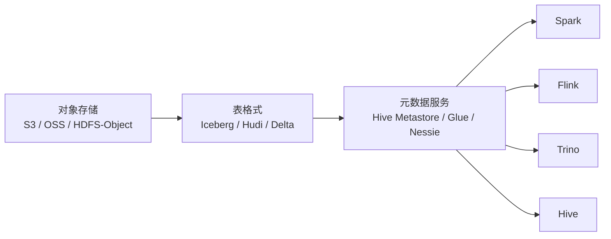
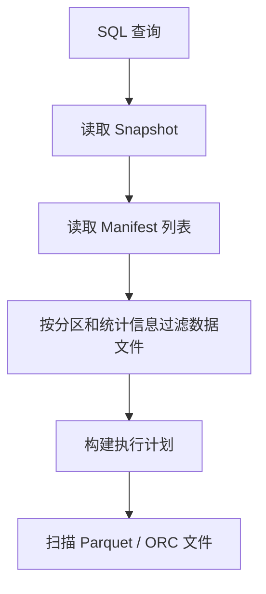
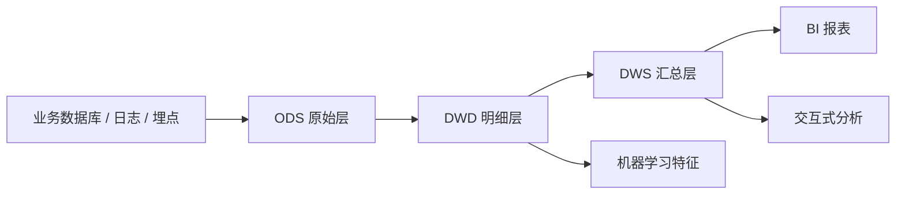

---
title: "湖仓一体架构详解：从数据湖到统一数据平台"
categories: [05_大数据]
tags: [大数据, 湖仓一体, Lakehouse, Iceberg, 数据架构]
layout: post
mermaid: true
---

湖仓一体（Lakehouse）是近几年数据平台演进中的一个关键方向。它试图解决一个长期存在的问题：数据湖的存储成本低、扩展性强，但治理能力弱；传统数仓治理规范、查询稳定，但建设和扩展成本较高。湖仓一体的核心目标，就是在统一存储之上，同时获得二者的主要优势。

---

## 1. 湖仓一体的基本定义

从概念上看，湖仓一体并不是“数据湖 + 一个查询引擎”这么简单，而是在对象存储之上引入表格式、事务语义、元数据管理与多引擎访问能力。

1. **统一存储**
   - 数据通常存储在 S3、OSS、HDFS-Object 等对象存储中。
   - 原始数据、中间层数据和结果层数据可以共享同一套底层存储。
2. **统一表模型**
   - 借助 Iceberg、Delta Lake、Hudi 等表格式，将“文件集合”提升为“可管理的数据表”。
   - 表格式负责快照、Schema 演进、分区变换、增量写入等能力。
3. **统一元数据**
   - 表结构、分区信息、快照信息、数据文件位置等都集中管理。
   - 这使查询引擎不再依赖目录扫描，而是依赖元数据直接定位数据。
4. **统一计算入口**
   - 同一份数据可以同时服务 Spark、Flink、Trino、Hive 等引擎。
   - 一份数据既能用于批处理，也能用于交互式分析和机器学习。



---

## 2. 数据湖、传统数仓与湖仓一体的差异

理解湖仓一体，最好的方式是把它放到“数据湖”和“传统数仓”的演进链路里看。

1. **传统数仓的特点**
   - 优势在于模型清晰、治理严格、查询性能稳定。
   - 常见架构是 `ODS -> DWD -> DWS -> DM` 的分层建模。
   - 问题在于存储成本高、弹性扩展弱、流批链路往往分离。
2. **数据湖的特点**
   - 优势在于低成本、海量扩展、支持结构化与非结构化数据。
   - 问题在于缺少事务控制、元数据治理薄弱、更新删除能力不足。
3. **湖仓一体的定位**
   - 保留对象存储的低成本和弹性。
   - 引入数仓所需的事务、一致性、表级治理和查询优化能力。

| 对比维度 | 传统数仓 | 数据湖 | 湖仓一体 |
| --- | --- | --- | --- |
| 存储介质 | 专用存储或高性能集群 | 对象存储 | 对象存储 |
| 数据组织方式 | 库表模型 | 文件集合 | 表格式 + 文件 |
| 事务能力 | 较强 | 较弱或缺失 | 较强 |
| Schema 演进 | 相对严格 | 较自由但缺治理 | 可控且安全 |
| 多引擎访问 | 一般较弱 | 较强 | 强 |
| 典型问题 | 成本高、扩展慢 | 治理弱、性能不稳 | 需要额外建设表格式和治理体系 |

---

## 3. 湖仓一体的核心组件

一个可用的湖仓平台，通常由以下几部分组成。

### 3.1. 存储层

1. **对象存储**
   - 负责保存 Parquet、ORC 等列式数据文件。
   - 重点是低成本、高耐久和弹性扩展。
2. **列式文件格式**
   - 常见格式包括 Parquet 和 ORC。
   - 支持压缩、列裁剪、谓词下推，是分析型查询性能的基础。

### 3.2. 管理层

1. **表格式**
   - Iceberg、Delta Lake、Hudi 是湖仓一体的关键组件。
   - 它们维护快照、文件清单、分区变换和事务提交过程。
2. **元数据服务**
   - 常见实现包括 Hive Metastore、AWS Glue、Project Nessie。
   - 负责统一保存表定义、版本信息与访问入口。

### 3.3. 计算层

1. **批处理引擎**
   - 以 Spark 为代表，适合离线 ETL、聚合和数仓建模。
2. **流处理引擎**
   - 以 Flink 为代表，适合 CDC、实时写入和近实时计算。
3. **交互式查询引擎**
   - 以 Trino、Hive 为代表，适合 BI 查询和临时分析。

下面是一段以 Iceberg 为例的建表示例，可以直观体现“对象存储 + 表格式”的落地方式：

```sql
CREATE TABLE dwd_order_detail (
    order_id        BIGINT,
    user_id         BIGINT,
    sku_id          BIGINT,
    order_amount    DECIMAL(16, 2),
    order_status    STRING,
    dt              DATE
)
USING iceberg
PARTITIONED BY (days(dt));
```

---

## 4. 查询链路为何发生了变化

传统 Hive 表和 Iceberg 表在查询启动阶段的差异，直接决定了两者在大表、大分区场景下的体验差别。

### 4.1. 传统 Hive 表的查询特点

1. **依赖目录与分区枚举**
   - 分区越多，Metastore 查询和目录扫描越重。
   - 当分区达到几十万、上百万时，查询启动时间会显著变长。
2. **容易受小文件影响**
   - 每个分区下如果存在大量小文件，系统就要做更多 `listStatus` 和 RPC 调用。
3. **计划生成成本高**
   - Driver 需要读取大量文件和分区信息，容易造成内存膨胀。

### 4.2. Iceberg 表的查询特点

1. **先读 Snapshot**
   - 查询首先读取当前表的快照信息，确定最新可见版本。
2. **再读 Manifest**
   - Manifest 记录了数据文件路径、分区值、统计信息等。
3. **最后再定位数据文件**
   - 通过分区裁剪和文件级过滤，只读取必要的数据文件。



下面的示例能够说明这种查询路径的价值：

```sql
SELECT order_id, order_amount
FROM dwd_order_detail
WHERE dt = DATE '2026-01-07'
  AND order_amount > 1000;
```

对于这类 SQL，查询引擎通常可以完成两层过滤：

1. **分区裁剪（Partition Pruning）**
   - 直接只选择 `dt = '2026-01-07'` 对应的分区文件。
2. **文件级过滤（File-level Filtering）**
   - 借助 Manifest 中的列统计信息，跳过明显不满足条件的数据文件。

---

## 5. 湖仓一体解决了哪些关键问题

湖仓一体之所以成为主流方向，本质上是因为它在多个核心矛盾上做了平衡。

### 5.1. 成本与扩展性

1. **底层采用对象存储**
   - 相比传统数仓专用存储，更适合 PB 级甚至更大规模的数据量。
2. **存算分离更容易实现**
   - 计算资源可以按需扩缩容，不必长期绑定在固定存储集群上。

### 5.2. 治理与一致性

1. **支持事务和快照**
   - 支持 append、overwrite、delete、merge 等常见写操作。
2. **支持 Schema 演进**
   - 增加字段、调整字段顺序、部分场景下的字段变更更加安全。
3. **支持时间旅行**
   - 可以按快照回看历史数据，方便审计与问题排查。

### 5.3. 实时化与多引擎协同

1. **支持 CDC 和 Upsert**
   - 更适合把数据库增量数据持续同步进分析平台。
2. **支持多引擎共享**
   - 避免“同一份数据为不同引擎重复存储”的问题。

下面是一段常见的增量合并示例：

```sql
MERGE INTO dwd_order_detail t
USING ods_order_cdc s
ON t.order_id = s.order_id
WHEN MATCHED THEN UPDATE SET
    order_amount = s.order_amount,
    order_status = s.order_status
WHEN NOT MATCHED THEN INSERT (
    order_id, user_id, sku_id, order_amount, order_status, dt
) VALUES (
    s.order_id, s.user_id, s.sku_id, s.order_amount, s.order_status, s.dt
);
```

---

## 6. 工程落地时的设计要点

即使采用了湖仓一体，也不意味着传统数仓方法论失效。真正落地时，仍然需要重视建模、分层和治理。

### 6.1. 分层设计仍然重要

1. **ODS 层**
   - 保存原始接入数据，强调可追溯和最小加工。
2. **DWD 层**
   - 对原始数据进行清洗、标准化与事实建模。
3. **DWS / ADS / DM 层**
   - 面向主题分析、报表服务和业务指标消费。

### 6.2. 建设过程中需要特别关注的问题

1. **分区设计不要过细**
   - 过细的分区仍然会导致文件数量膨胀。
2. **小文件治理要制度化**
   - 需要配套 compaction、rewrite 等周期任务。
3. **元数据治理不能缺位**
   - 表生命周期、权限、血缘、质量规则仍然要建设。
4. **选型要结合场景**
   - Iceberg 更强调查询生态和开放性。
   - Hudi 更常见于增量写入和近实时场景。
   - Delta Lake 在 Databricks 生态中集成度较高。

可以将一个典型的湖仓平台理解为如下流程：



---

## 7. 总结

湖仓一体并不是简单地用对象存储替代传统数仓，而是在低成本存储基础上，通过表格式、事务机制和统一元数据，把数据湖升级为可治理、可演进、可共享的数据平台。

如果从工程视角来理解，它的价值主要体现在三个方面：

1. **一份数据，多种用途**
   - 同时支持离线分析、交互式查询、实时处理和机器学习。
2. **统一存储，降低成本**
   - 避免重复搬运和多份存储带来的资源浪费。
3. **统一治理，提升可维护性**
   - 在开放生态中获得接近数仓的治理能力。

对于企业而言，湖仓一体更像是一种数据平台建设思路，而不是某一个单独产品。真正决定效果的，不只是选了 Iceberg、Hudi 还是 Delta，更在于建模规范、治理体系和计算引擎协同是否真正落地。
