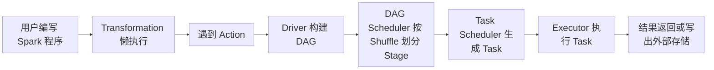
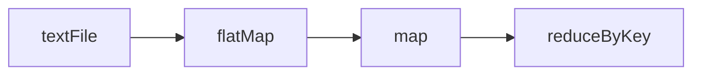
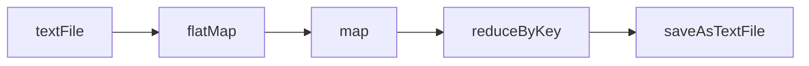
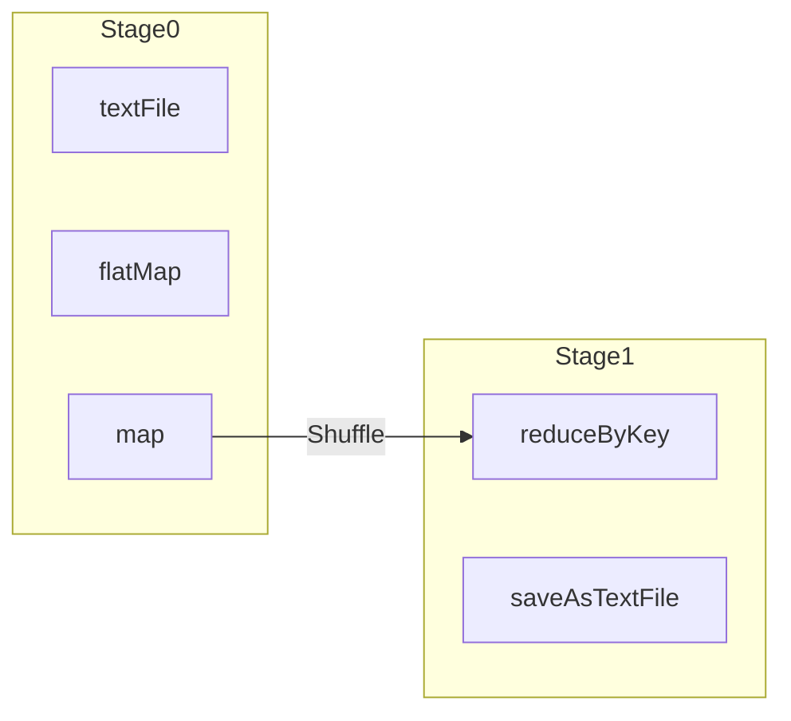
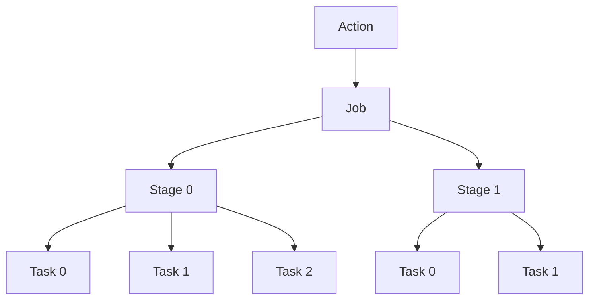
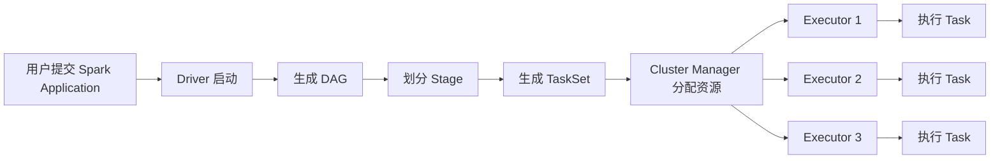
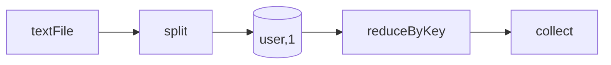
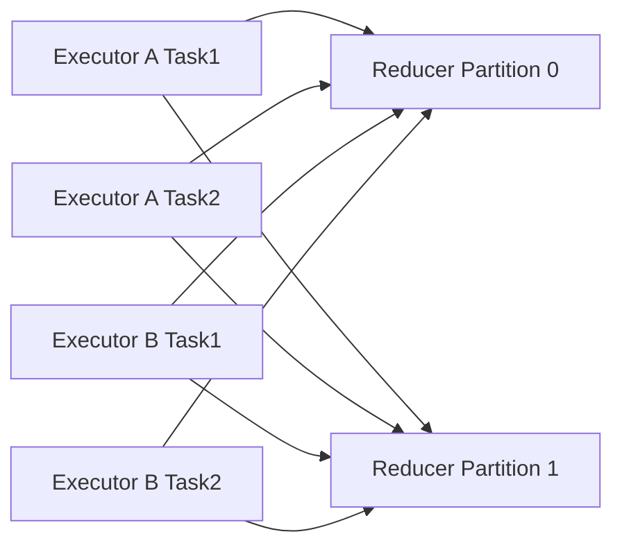
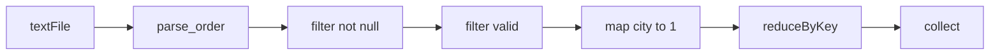

> 很多人第一次学 Spark，会觉得它“比 MapReduce 快”，也知道它“基于内存”“支持 DAG”，但一旦被问到：
>
> * Spark 程序到底是怎么运行起来的？
> * Job、Stage、Task 到底是什么关系？
> * 为什么遇到 Shuffle 要切 Stage？
> * Spark 和 MapReduce 的本质区别到底在哪里？
>
> 就容易停留在概念层面。
> 这篇文章就从 **“对比 MapReduce 的执行方式”** 这个角度，系统讲透 Spark 的运行机制。

---

## Spark 执行模型概述

传统 MapReduce 的执行模型非常规整：
一个任务通常围绕 **Map → Shuffle → Reduce** 展开，中间结果大量依赖磁盘落盘。

而 Spark 的核心思想是：

> **先描述计算逻辑，再在真正需要结果时统一生成执行计划。**

也就是说，Spark 不会一上来就把程序强行套进固定的 Map/Reduce 两阶段里，而是先把一系列转换操作组织成 **DAG（有向无环图）**，再根据依赖关系拆成多个执行阶段。

这带来两个直接变化：

1. **多个连续转换可以合并执行**，减少中间 IO
2. **只有在真正发生数据重分布（Shuffle）时才切分阶段**

所以，Spark 相比传统 MapReduce，更像是一个 **“按依赖调度的分布式计算引擎”**，而不是一个固定流程的批处理框架。

---


从整体架构视角看，Spark 运行机制主要涉及以下几个核心角色：

* **Driver**：负责任务规划和调度
* **Executor**：真正执行任务的进程
* **DAG Scheduler**：把 DAG 切成多个 Stage
* **Task Scheduler**：把 Stage 分解成 Task 并调度执行

你可以先记一句：

> **Spark 不是一提交就立即执行每一步，而是先记住计算过程，等到 Action 触发时，再统一生成执行计划。**

---

## Spark 程序的整体执行流程

先看一个最常见的 Spark WordCount 程序：

```python
rdd = sc.textFile("hdfs:///data/words.txt")

result = (
    rdd.flatMap(lambda line: line.split(" "))
       .map(lambda word: (word, 1))
       .reduceByKey(lambda a, b: a + b)
)

result.saveAsTextFile("hdfs:///out/wordcount")
```

很多初学者会觉得，程序从第一行开始就已经在集群上执行了。
其实不是。

Spark 的真实过程是这样的：



**第一步是描述计算逻辑，而不是立即计算**

像 `map`、`filter`、`flatMap` 这样的 Transformation，只是在不断补充“这份数据应该如何被处理”，此时 Spark 还没有真正把任务提交到集群执行。

**第二步是由 Action 触发真正的作业执行**

只有当程序调用 `count()`、`collect()`、`saveAsTextFile()` 这类 Action 时，Spark 才会认为“现在需要结果了”，并开始把前面记录下来的处理链条转成可执行计划。

**第三步是 Driver 负责把逻辑计划整理成执行计划**

Driver 会先根据 RDD 的血缘关系构建 DAG，再由 DAG Scheduler 按是否发生 Shuffle 划分 Stage。可以把这一步理解为：先看清数据依赖，再决定哪些步骤能连着跑，哪些步骤必须分段执行。

**第四步是把 Stage 拆成多个可以并行运行的 Task**

Task Scheduler 会继续把每个 Stage 按分区拆成多个 Task，然后把这些 Task 分发给不同的 Executor。真正落到机器上跑的，不是 Job，也不是 Stage，而是一个个 Task。

**第五步是 Executor 在集群中并行处理数据**

Executor 接到 Task 后，才会实际读取分区数据、执行算子逻辑、完成 Shuffle 读写，并最终把结果返回给 Driver，或者写入 HDFS、对象存储等外部系统。

---

## Spark 运行机制的核心概念

Spark 中的算子，大体分为两类：

### Transformation 与 Action

这类算子只是定义“怎么处理数据”，不会立刻执行。

常见的有：

* `map`
* `flatMap`
* `filter`
* `distinct`
* `reduceByKey`
* `join`

例如：

```python
rdd2 = rdd.map(lambda x: x * 2)
rdd3 = rdd2.filter(lambda x: x > 10)
```

这两行代码执行完，不代表数据已经处理完成。
Spark 只是记录了：

* 先把每个元素乘以 2
* 再把大于 10 的保留下来

**Action：动作类算子**

只有 Action 才会真正触发作业执行。

常见 Action 有：

* `count()`
* `collect()`
* `take()`
* `saveAsTextFile()`
* `foreach()`

例如：

```python
print(rdd3.count())
```

这时候 Spark 才会沿着前面的依赖链，真正去集群里跑任务。

---

### 懒执行机制及其设计原因

这是 Spark 和传统 MapReduce 很不同的地方。

如果每写一步就立刻执行，会有两个问题：

**无法进行全局优化**

例如下面这段代码：

```python
rdd.map(...).filter(...).map(...)
```

如果系统知道这是一整条链路，就可以把这些窄依赖操作串起来，减少中间结果输出。

**容易产生大量不必要的计算**

有些中间 RDD 可能只是临时变量，最终根本没被用到。
懒执行可以避免无意义的计算。

---

### RDD 与血缘关系

要理解 Spark 运行过程，绕不开 **RDD**。

**什么是 RDD？**

RDD 全称是 **Resilient Distributed Dataset**，即：

* **Resilient**：可恢复、可容错
* **Distributed**：分布式
* **Dataset**：数据集

它可以理解为：

> **一个被分区后的、可并行处理的分布式数据集合。**

例如：

```python
rdd = sc.textFile("hdfs:///data/words.txt")
```

这个 `rdd` 并不是一个普通 Python 列表，而是一个分布式数据抽象。
它的数据可能分散在很多机器上，每个分区由不同 Task 处理。

---

**什么是血缘（Lineage）？**

RDD 最重要的一个特性，不只是“存数据”，而是“记录它是怎么来的”。

例如：

```python
rdd1 = sc.textFile("hdfs:///data/words.txt")
rdd2 = rdd1.flatMap(lambda line: line.split(" "))
rdd3 = rdd2.map(lambda word: (word, 1))
rdd4 = rdd3.reduceByKey(lambda a, b: a + b)
```

这里的依赖关系可以表示为：



这个依赖链就叫 **血缘关系**。

---

**血缘机制的作用**

血缘最大的意义是：**容错**。

传统 MapReduce 大量依赖中间结果落盘，所以某个任务失败后，往往可以从落盘数据继续。

Spark 不是每一步都落盘，那如果某个分区丢失怎么办？

答案是：**按血缘重算**。

比如某个 Executor 宕机，导致 `rdd3` 的一个分区丢了，Spark 可以回溯：

* 这个分区来自 `rdd2`
* `rdd2` 来自 `rdd1`
* `rdd1` 可以从 HDFS 重新读取

然后只重算丢失分区，不需要全量重跑。

这就是 RDD “Resilient” 的核心。

---

### DAG 的生成过程

当 Action 触发后，Driver 会根据一系列 RDD 的血缘关系，生成一张 **DAG 执行图**。


*图片来源：Wikimedia Commons，[Directed acyclic graph.svg](https://commons.wikimedia.org/wiki/File:Directed_acyclic_graph.svg)。*

还是看前面的 WordCount：

```python
rdd = sc.textFile("hdfs:///data/words.txt")

result = (
    rdd.flatMap(lambda line: line.split(" "))
       .map(lambda word: (word, 1))
       .reduceByKey(lambda a, b: a + b)
)

result.saveAsTextFile("hdfs:///out/wordcount")
```

从逻辑上看，它的 DAG 可以画成这样：



注意，这张图只是 **逻辑依赖图**，还不是最终执行阶段。

DAG 的价值在于：

* 它描述了完整的数据流向
* 它告诉 Spark 哪些算子之间存在依赖
* 它让 Spark 可以根据依赖类型决定如何切分执行阶段

---

### Shuffle、Stage 与任务划分

这是 Spark 运行机制里最关键的一点。

很多人知道 Spark 会把 Job 划分成多个 Stage，但不清楚为什么这么切。

答案是：

> **Spark 是按宽依赖（通常对应 Shuffle）来切分 Stage 的。**

---

**窄依赖与宽依赖**

**窄依赖（Narrow Dependency）**

父 RDD 的一个分区，只会被子 RDD 的一个分区使用。

典型算子：

* `map`
* `filter`
* `flatMap`

例如：

```python
rdd2 = rdd1.map(lambda x: x + 1)
```

`rdd1` 的第 1 个分区，只会影响 `rdd2` 的第 1 个分区。
这种依赖不需要跨节点拉取大量数据，适合在一个 Stage 内连续执行。

---

**宽依赖（Wide Dependency）**

父 RDD 的一个分区，可能会被多个子分区依赖。
这通常意味着数据需要按照 key 重新分区，也就是发生 **Shuffle**。

典型算子：

* `reduceByKey`
* `groupByKey`
* `join`
* `distinct`
* `repartition`

例如：

```python
rdd3 = rdd2.reduceByKey(lambda a, b: a + b)
```

因为相同 key 的数据可能分布在不同分区中，必须先把它们拉到同一个分区里再聚合。

---

**Shuffle 为何会成为 Stage 的边界**

因为 Shuffle 的本质是：

* 上一个阶段先把数据写出去
* 下一个阶段再从各处拉回来

也就是说，Shuffle 天然把执行过程切成了“前后两段”。

所以 Spark 的一个经典规则是：

> **窄依赖可以流水线执行，宽依赖必须切 Stage。**

---

**WordCount 示例中的 Stage 划分**

继续看这个例子：

```python
rdd = sc.textFile("hdfs:///data/words.txt")

result = (
    rdd.flatMap(lambda line: line.split(" "))
       .map(lambda word: (word, 1))
       .reduceByKey(lambda a, b: a + b)
)

result.saveAsTextFile("hdfs:///out/wordcount")
```

它的 Stage 可以划分为：



解释：

* `textFile → flatMap → map` 都是窄依赖，可以放一个 Stage
* `reduceByKey` 需要按 key 重分区，发生 Shuffle，因此切到下一个 Stage
* `saveAsTextFile` 可以跟在 Stage1 后面继续执行

---

### Job、Stage 与 Task 的关系

这是面试高频问题，也是初学者最容易混淆的点。

---

**Job：一次 Action 触发一个 Job**

例如：

```python
rdd.count()
rdd.collect()
```

如果这两行都执行，那么通常会触发 **两个 Job**。

因为每个 Action 都意味着一次“我要结果”的请求，Spark 会为它单独生成一个作业。

---

**Stage：Job 按 Shuffle 切分形成的阶段**

一个 Job 会被拆成多个 Stage。
拆分依据就是前面讲的：**是否存在宽依赖/Shuffle**。

---

**Task：真正运行在 Executor 上的最小执行单元**

一个 Stage 会再按照 **分区数** 拆成多个 Task。

例如：

* 当前 Stage 有 100 个分区
* 那么这个 Stage 通常会生成 100 个 Task
* 每个 Task 处理一个分区

---

**三者之间的关系**



这张图可以从上往下看成一个逐层拆分的过程。
Action 先触发一个 Job，Job 再按 Shuffle 边界拆成多个 Stage，而每个 Stage 最终都会按分区数展开成多个 Task。
因此，真正决定并行度的，通常不是 Job 的数量，而是 Stage 内部能够拆出的 Task 数量。

可以记成一句：

> **Action 触发 Job，Job 按 Shuffle 切 Stage，Stage 按分区拆 Task。**

---

### Driver 与 Executor 的职责分工

Spark 程序真正跑起来时，主要涉及两个核心角色。

---

**Driver：调度与控制中心**

Driver 负责：

* 创建 `SparkContext` / `SparkSession`
* 解析用户代码
* 生成 DAG
* 划分 Stage
* 生成 TaskSet
* 调度任务到 Executor
* 收集结果和监控状态

简单理解：

> **Driver 不负责大规模数据计算，它负责“想清楚怎么跑”。**

---

**Executor：任务执行主体**

Executor 负责：

* 接收 Driver 分发的 Task
* 执行具体计算逻辑
* 管理缓存数据
* 负责 Shuffle 数据读写
* 把执行状态和结果汇报给 Driver

简单理解：

> **Executor 不做全局规划，它只负责“真正干活”。**

---

**完整执行过程示意**



这张图强调的是“资源调度视角”下的执行过程。
前半段由 Driver 负责生成执行计划，后半段则由集群管理器分配资源、由多个 Executor 并行消费 Task。
阅读时可以重点把握两个边界：`生成 TaskSet` 之前主要是规划过程，`Executor 执行 Task` 之后才是真正的数据处理过程。

---

## Spark 执行流程示例分析

下面用一个稍微复杂一点的例子，统计日志中每个用户的访问次数。

假设日志数据如下：

```text
u1,login
u2,login
u1,click
u3,login
u2,click
u1,logout
```

对应的 Spark 代码：

```python
logs = sc.textFile("hdfs:///data/logs.txt")

user_cnt = (
    logs.map(lambda line: line.split(","))
        .map(lambda arr: (arr[0], 1))
        .reduceByKey(lambda a, b: a + b)
)

print(user_cnt.collect())
```

输出结果：

```python
[('u1', 3), ('u2', 2), ('u3', 1)]
```

---

### 日志统计示例的执行流程



---

**逻辑 DAG**

这里 `split` 和 `(user,1)` 都是窄依赖，
`reduceByKey` 是宽依赖，所以划分成：

* **Stage 0**：读取数据、切分、映射成 `(user,1)`
* **Stage 1**：按用户聚合、返回结果

---

**Stage 划分**

假设原始日志文件有 2 个分区。

**Stage 0**

两个 Task 分别处理两个分区：

**Partition 0**

```text
u1,login
u2,login
u1,click
```

处理后：

```text
(u1,1)
(u2,1)
(u1,1)
```

**Partition 1**

```text
u3,login
u2,click
u1,logout
```

处理后：

```text
(u3,1)
(u2,1)
(u1,1)
```

---

**Shuffle**

为了执行 `reduceByKey`，Spark 会按 key 重新分区：

例如：

* `u1` → Reduce 分区 0
* `u2`、`u3` → Reduce 分区 1

此时 Stage 0 的各个 Task 会把自己的中间结果按目标分区写出去，供 Stage 1 拉取。

---

**Stage 1**

对应分区的 Task 拉取数据并聚合：

**Reducer Partition 0**

```text
u1 -> [1,1,1] -> (u1,3)
```

**Reducer Partition 1**

```text
u2 -> [1,1] -> (u2,2)
u3 -> [1] -> (u3,1)
```

最后 `collect()` 把结果返回给 Driver。

---

## Spark 的性能特点与开发关注点

注意，这里说的是“通常”，不是“绝对”。

Spark 更快的原因，核心不在于一句“内存计算”，而在于以下几个层面共同作用。

---

### Spark 通常快于 MapReduce 的原因

**多个窄依赖算子可以流水线执行**

像下面这种链式处理：

```python
rdd.map(...).filter(...).map(...)
```

在 Spark 中可以放在一个 Stage 中连续跑完，避免每一步都产生中间落盘。

而传统 MapReduce 更倾向于把计算拆成较固定的阶段，中间边界更重。

---

**减少中间结果的磁盘 IO**

Spark 并不是完全不落盘，但它不会像传统 MapReduce 那样，默认把每个中间步骤都当成强边界处理。

只有在以下场景，Spark 才更明显依赖磁盘：

* Shuffle
* 内存不足触发 spill
* 结果输出
* 持久化级别选择磁盘

所以本质上，Spark 的优势是：

> **尽量把连续计算留在内存和流水线中完成，只在必须时才发生重型 IO。**

---

**更适合迭代型计算**

例如机器学习、图计算、反复查询：

* MapReduce 每一轮都可能重复读取和写出数据
* Spark 可以通过 `cache()` / `persist()` 把热点数据保留在内存中，反复复用

---

### 缓存机制的重要性

缓存是 Spark 区别于传统 MapReduce 的另一个非常关键的能力。

例如：

```python
data = sc.textFile("hdfs:///data/logs.txt") \
         .map(parse_log) \
         .filter(lambda x: x is not None)

data.cache()

print(data.count())
print(data.take(10))
```

如果不加 `cache()`：

* `count()` 会把整条血缘链跑一遍
* `take(10)` 又会把整条血缘链跑一遍

加了 `cache()` 后：

* 第一次 Action 执行完，数据会被缓存
* 第二次 Action 可以直接复用缓存结果

---

**`cache` 与 `persist` 的区别**

```python
rdd.cache()
```

等价于：

```python
rdd.persist()
```

默认级别通常是内存优先。

如果你希望更明确控制持久化方式，可以：

```python
from pyspark import StorageLevel

rdd.persist(StorageLevel.MEMORY_AND_DISK)
```

常见策略：

* `MEMORY_ONLY`
* `MEMORY_AND_DISK`
* `DISK_ONLY`

---

**为什么缓存不能被随意使用**

缓存有收益，也有成本：

* 占用 Executor 内存
* 内存不够可能反而导致频繁淘汰或 spill
* 不会自动让所有程序都变快

适合缓存的场景：

* 同一个 RDD 会被重复使用
* 上游计算代价较高
* 数据量适中，能较稳定放入内存

---

### Shuffle 为何是性能优化的重点

学习 Spark 到后面会发现：

> **真正影响 Spark 性能的，不是 map/filter，而是 Shuffle。**

因为 Shuffle 涉及：

* 网络传输
* 磁盘读写
* 数据序列化/反序列化
* 排序/合并
* 内存占用与溢写

---

**哪些算子容易触发 Shuffle？**

常见触发者：

* `reduceByKey`
* `groupByKey`
* `join`
* `distinct`
* `repartition`
* `sortByKey`

---

**为什么 `groupByKey` 通常不如 `reduceByKey`**

看下面两种写法：

**写法一：`groupByKey`**

```python
rdd.map(lambda x: (x, 1)).groupByKey().mapValues(sum)
```

**写法二：`reduceByKey`**

```python
rdd.map(lambda x: (x, 1)).reduceByKey(lambda a, b: a + b)
```

区别在于：

* `groupByKey` 会先把所有 value 拉到一起，再求和
* `reduceByKey` 可以先在 map 端做局部聚合，减少 Shuffle 数据量

因此在大多数聚合场景下，`reduceByKey` 更优。

---

**Shuffle 过程示意图**



这张图表达的就是：

* 上游每个 Task 都可能把数据发往多个下游分区
* 下游每个 Task 又要从多个上游节点拉数据

也可以把它理解成一个“多对多重组”的过程。
只要进入 Shuffle，数据通常就不再局限于原来的本地分区，而是要跨节点重新分布、拉取和汇总。
这正是 Shuffle 同时消耗网络、磁盘和序列化开销的原因，也是 Spark 调优时最需要关注的环节之一。

这也是 Shuffle 成本高的根本原因。

---

### 容错与恢复机制

Spark 的容错机制，核心是两类思路：

**基于血缘的重算**

这是 RDD 的核心设计。

当某个分区丢失时，Spark 可以沿着血缘重新计算这个分区，而不需要像传统 MapReduce 那样依赖每一步的中间持久化。

---

**基于持久化与检查点的恢复**

对于血缘过长或者代价较高的场景，可以手动做：

* `persist()`
* `checkpoint()`

例如：

```python
rdd.checkpoint()
```

`checkpoint` 会把数据真正写到可靠存储中，截断血缘链。
适合：

* 迭代计算很多轮
* 血缘链过长
* 恢复成本高

---

### 开发实践中的关注重点

学完运行过程后，写 Spark 程序时最应该关注这几件事。

---

**代码是否会触发 Shuffle**

这是第一优先级。

因为一旦触发 Shuffle，往往意味着：

* Stage 会切分
* 网络和磁盘开销增大
* 程序性能复杂度明显上升

---

**哪些算子可以合并在同一个 Stage 中**

例如：

```python
rdd.map(...).filter(...).map(...)
```

这类窄依赖链适合连续处理。
理解这一点有助于你读 Spark UI，也有助于推测性能瓶颈。

---

**是否需要使用缓存**

如果某个中间结果会被重复使用，就要考虑 `cache/persist`。

---

**分区数量是否合理**

分区数过少：

* 并行度不够
* 集群资源利用率低

分区数过多：

* Task 调度开销变大
* 小文件、小任务过多

---

### 订单统计示例的执行流程

下面给一个更贴近业务开发的示例。

需求：
统计每个城市的订单数量，并筛掉异常数据。

原始数据格式：

```text
1001,beijing,120
1002,shanghai,300
1003,beijing,200
1004,,500
1005,shanghai,150
1006,beijing,-1
```

Spark 代码：

```python
def parse_order(line):
    arr = line.split(",")
    if len(arr) != 3:
        return None
    order_id, city, amount = arr[0], arr[1], arr[2]
    try:
        amount = int(amount)
    except:
        return None
    return (order_id, city, amount)

orders = sc.textFile("hdfs:///data/orders.txt")

result = (
    orders.map(parse_order)
          .filter(lambda x: x is not None)
          .filter(lambda x: x[1] != "" and x[2] >= 0)
          .map(lambda x: (x[1], 1))
          .reduceByKey(lambda a, b: a + b)
)

print(result.collect())
```

输出：

```python
[('beijing', 2), ('shanghai', 2)]
```

---

**如何理解这段程序的执行过程**

**Stage 0**

下面这些都属于窄依赖：

* `map(parse_order)`
* `filter(is not None)`
* `filter(city and amount valid)`
* `map((city,1))`

它们可以在同一个 Stage 中流水线执行。

**Stage 1**

`reduceByKey` 触发 Shuffle，进入下一个 Stage 聚合。

---

**对应的 DAG**



---

**这段代码相较“传统 MapReduce 思维”的优势**

如果用传统 MapReduce 的思维，可能会更习惯把它拆成多个阶段式处理：

* 第一步清洗
* 第二步映射
* 第三步聚合

而 Spark 可以让这些窄依赖步骤在同一个 Stage 内串起来执行，逻辑更自然，性能通常也更好。

---

## 学习总结与延伸思考

### 对 Spark 运行过程的整体理解

如果把全文压缩成一条主线，可以概括为：

> **Spark 程序中的 Transformation 会先形成 RDD 血缘，而不会立即执行；当 Action 触发时，Driver 根据血缘关系生成 DAG，并按照 Shuffle 边界划分 Stage，再按分区拆分为多个 Task，最终交由 Executor 并行执行。**

### 阅读本文时建议重点关注的问题

**为什么 Spark 能比 MapReduce 更灵活**

关键不在于“是否使用内存”这一句话，而在于 DAG 调度、懒执行和按依赖划分阶段的整体设计。

**为什么 Shuffle 会成为性能与结构的分界点**

一旦发生 Shuffle，通常就意味着数据需要跨分区、跨节点重组，这既改变了执行结构，也直接影响性能成本。

**为什么缓存不能被机械使用**

缓存适合重复使用、计算代价高且数据规模可控的场景；如果使用不当，反而会增加内存压力和执行开销。

### 延伸思考

1. 为什么 `reduceByKey` 通常比 `groupByKey` 更高效？
2. 为什么 Spark 要按 Shuffle 而不是按算子数量划分 Stage？
3. 如果一个 RDD 被多个 Action 重复使用，是否应该缓存？
4. Spark 的血缘容错与 MapReduce 的落盘容错分别适合哪些场景？
5. 分区数过大或过小，会分别带来哪些问题？

---
