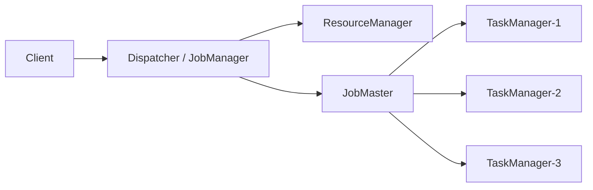
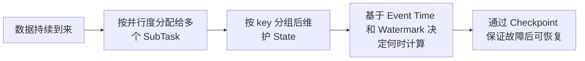

## 1. Flink 概述

Flink 是一个面向分布式场景的流处理框架，擅长对持续到来的数据进行实时计算，同时也支持对有界数据进行处理。对于初学者来说，可以先将它理解为：**一个专门处理实时数据的计算引擎**。

与传统“先存储、后计算”的离线处理方式不同，Flink 更强调 **数据到达即处理、结果持续更新**。这使它非常适合日志处理、实时指标统计、监控告警、用户行为分析、风控计算等业务场景。

从程序结构上看，Flink 作业通常都可以抽象为如下形式：

```text
Source --> Transformation --> Sink
数据源      中间处理           输出
```

也就是说，一个 Flink 程序本质上就是：**从数据源读取数据，经过一系列转换处理后，再将结果写出。**

### 1.1 Flink 的典型应用场景

Flink 的常见应用大致可以分为三类：

* **实时数据清洗与转换**：例如日志清洗、字段补全、实时 ETL
* **实时指标分析**：例如 PV、UV、订单量、转化率、异常统计
* **事件驱动型处理**：例如监控告警、规则匹配、实时风控

### 1.2 Flink 的核心特点

**流批统一**：既能处理无界流，也能处理有界数据。

**有状态计算能力强**：适合做计数、聚合、会话分析、用户行为追踪等依赖历史数据的场景。

**天然支持分布式并行执行**：可以将任务拆成多个并行子任务，运行在不同机器上。

**具备较完善的容错能力**：能够通过 Checkpoint 等机制实现故障恢复。

---

## 2. WordCount 示例解析

WordCount 是学习 Flink 最经典的入门案例。它的目标很简单：**统计每个单词出现的次数**。

例如输入如下文本：

```text
hello flink
hello world
flink world
```

最终输出结果为：

```text
hello 2
flink 2
world 2
```

虽然这个案例本身非常简单，但它已经完整体现了 Flink 程序最基本的处理链路：**读取数据、拆分数据、分组、聚合、输出结果**。

### 2.1 处理流程

WordCount 的执行流程可以概括为：

1. 读取文本数据。
2. 把一行文本拆成多个单词。
3. 将每个单词映射成 `(word, 1)`。
4. 按照 `word` 分组。
5. 对同一个单词进行累加。
6. 输出统计结果。


这条主线非常重要，因为后续绝大多数 Flink 程序，本质上都是在这个基础上不断扩展而来。

### 2.2 示例代码

下面给出一个适合初学者理解的 DataStream 版 WordCount 示例：

```java
import org.apache.flink.api.common.functions.FlatMapFunction;
import org.apache.flink.api.java.tuple.Tuple2;
import org.apache.flink.streaming.api.environment.StreamExecutionEnvironment;
import org.apache.flink.streaming.api.datastream.SingleOutputStreamOperator;
import org.apache.flink.util.Collector;

public class WordCountDemo {
    public static void main(String[] args) throws Exception {
        StreamExecutionEnvironment env =
                StreamExecutionEnvironment.getExecutionEnvironment();

        SingleOutputStreamOperator<Tuple2<String, Integer>> result = env
                .fromElements(
                        "hello flink",
                        "hello world",
                        "flink world"
                )
                .flatMap(new FlatMapFunction<String, Tuple2<String, Integer>>() {
                    @Override
                    public void flatMap(String line, Collector<Tuple2<String, Integer>> out) {
                        for (String word : line.toLowerCase().split("\\s+")) {
                            if (!word.isEmpty()) {
                                out.collect(Tuple2.of(word, 1));
                            }
                        }
                    }
                })
                .keyBy(data -> data.f0)
                .sum(1);

        result.print();

        env.execute("word count demo");
    }
}
```

### 2.3 关键代码说明

**`getExecutionEnvironment()`**：获取 Flink 的执行环境，可以理解为“程序准备在哪个环境中运行”。

**`fromElements()`**：构造一个最简单的数据源，适合本地演示。真实项目中通常会替换为 Kafka、文件系统或数据库等外部数据源。

**`flatMap()`**：用于把一条输入拆成多条输出。在 WordCount 中，它负责把一行文本拆成多个单词。

**`keyBy()`**：按照指定字段分组。这里按单词本身分组，目的是让相同单词进入同一组中进行统计。

**`sum(1)`**：对元组的第 2 个字段求和，也就是把每个单词对应的计数值 `1` 累加起来。

**`print()`**：将结果输出到控制台，是最简单的一种 Sink。

**`env.execute()`**：真正触发作业执行。没有这一句，Flink 程序不会真正运行。

### 2.4 从 WordCount 看 Flink 的基本思想

通过这个案例，可以初步理解 Flink 的三个重要特点：

**数据流处理思想**：程序围绕数据流转，而不是围绕某次批量计算展开。

**分组聚合思想**：先按 key 划分数据，再对相同 key 的数据进行处理。

**有状态计算思想**：单词计数的本质，就是系统需要记住“某个单词之前已经出现了多少次”。

---

## 3. Flink 运行架构

学习 Flink 时，除了会写程序，更重要的是理解程序究竟是如何跑起来的。Flink 的运行架构并不复杂，初学阶段先抓住三个核心角色即可：**Client、JobManager、TaskManager**。



一个 Flink 作业通常会经历下面这条路径：

1. 用户编写 `DataStream` 程序。
2. 调用 `execute()` 后，Client 将逻辑图转换为执行计划。
3. 作业计划和依赖 JAR 被提交到集群。
4. JobMaster 为该作业创建运行时图并申请资源。
5. TaskManager 拿到部署指令后启动各个并行 task。
6. 数据从 Source 持续流入，经过算子处理后输出到 Sink。

```text
用户代码 -> execute() -> 作业图 -> 提交集群 -> 资源分配 -> task 部署 -> 持续处理数据
```

### 3.1 核心组件职责

**Client**, 主要负责作业的提交。开发者写好程序后，通常由 Client 将程序打包、生成执行计划，并提交给 Flink 集群。
可以简单理解为：**Client 负责“交作业”。**

**JobManager**, JobManager 是 Flink 集群中的协调中心，主要负责：

* 接收作业
* 调度任务
* 协调各个执行节点
* 处理故障恢复
* 协调 Checkpoint

在更细的架构划分中，JobManager 还可以继续细分为 ResourceManager、Dispatcher、JobMaster 等组件，但对于初学者来说，先理解它是“调度与协调中心”即可。

**TaskManager**, 是真正执行计算任务的工作节点。一个 Flink 作业在运行时，会被拆分成多个并行子任务，这些子任务最终都会分配到不同的 TaskManager 上执行。
可以简单理解为：**TaskManager 负责“真正干活”。**

### 3.3 Task、SubTask 与 Slot

这几个概念很容易混淆，可以放在一起理解。

| 概念 | 所属层次 | 定义 |
| --- | --- | --- |
| Operator | 逻辑层 | 程序中的算子，如 `map`、`filter`、`window` |
| SubTask | 并行层 | 一个 operator 的某个并行实例 |
| Task | 运行时层 | 实际部署到 TaskManager 上执行的单元 |
| Slot | 资源层 | TaskManager 提供的逻辑资源配额 |

**SubTask**, 如果一个算子的并行度设置为 4，那么它就会被拆成 4 个并行执行实例，这 4 个实例就可以理解为 4 个 SubTask。

**并行度越高，同时工作的 SubTask 数量通常越多。**

**Task**, Flink 在执行时，会将一组可以串联的算子组成一个 Task。这样做的目的是减少线程切换和数据传输开销，提高执行效率。

**可以理解为：Task 是一段被安排在一起执行的计算单元。**

**Slot** 是 TaskManager 中最小的资源调度单位。一个 TaskManager 可以包含多个 Slot，作业中的 SubTask 会被分配到这些 Slot 中运行。

可以用一个简单类比帮助理解：

* **TaskManager**：工厂
* **Slot**：工位
* **SubTask**：工人
* **Task**：工人当前要完成的一组工作

---

## 4. Flink 的运行模式：本地运行与 YARN 运行

Flink 程序写好之后，还需要运行起来。对初学者来说，最常见的两类运行方式就是：**本地运行** 和 **YARN 运行**。

### 4.1 本地运行

本地运行主要有两种常见理解。

**1、本地开发调试**

第一种是直接在 IDE 中运行程序。这种方式最适合初学阶段使用，因为可以快速验证逻辑，方便断点调试，适合理解 API 和程序执行过程。

**这一阶段的重点不是部署，而是先把程序写通、跑通。**

**2、本地单机集群运行**

第二种是在本机启动一个单机版 Flink 集群，然后再把程序提交到这个本地集群上执行。它比 IDE 直接运行更接近真实集群环境。

本地集群启动后，通常可以通过 Web UI 查看任务运行情况。这种方式适合在学习早期过渡到“提交作业”的理解。

### 4.2 YARN 运行

在大数据平台中，很多企业会将 Flink 部署到 Hadoop YARN 之上，由 YARN 来统一管理资源。此时 Flink 集群中的 JobManager 和 TaskManager 会运行在 YARN 申请到的容器中。这种方式更贴近真实生产环境。

**可以简单理解为：YARN 运行就是把 Flink 交给 Hadoop 集群来调度和管理。**

Flink 在 YARN 上运行时，常见的模式主要有两类。

**1、Session Mode**

Session Mode 的思路是：**先启动一个 Flink 集群，再向这个集群中提交多个作业。**

这种模式适合多个小作业共享同一个集群资源。优点是资源复用较好，缺点是不同作业之间的隔离性相对一般。

**2、Application Mode**

Application Mode 的思路是：**一个应用对应一个独立的 Flink 集群。**

也就是说，作业启动时会拉起一个专属集群，作业结束后，该集群通常也会随之结束。

这种模式隔离性更好，也更接近现代生产环境中推荐的部署方式。

---

## 5. Flink 核心概念

Flink 的很多难点，不在于 API 数量多，而在于几个底层概念比较抽象。只要把这些关键概念理顺，后续学习窗口、状态、容错时就不会太吃力。

### 5.1 有界流与无界流

Flink 同时支持处理有界数据和无界数据。

**有界流**：数据有明确起点和终点，例如一批离线文件。

**无界流**：数据持续不断到来，没有明确结束时间，例如 Kafka 中不断写入的消息流。

实时计算场景中，更多面对的是无界流。

### 5.2 并行度

并行度表示同一个算子同时有多少个并行实例在执行。

例如，一个算子的并行度为 4，就表示这个算子会拆成 4 个并行子任务分别处理数据。并行度会直接影响作业的吞吐能力和资源使用情况。

**可以简单记为：并行度 = 同时工作的“分身”数量。**

### 5.3 状态

状态是 Flink 中非常重要的概念。很多业务并不是只看当前一条数据，而是要结合历史数据一起判断，这时就需要状态。

例如：

* 某个单词之前已经出现了多少次
* 某个用户最近 10 分钟点击了多少次
* 某个设备最近是否连续上报异常数据

这些“历史信息”就是状态。

**一句话理解：状态就是程序在处理过程中“记住的内容”。**

### 5.4 事件时间

在流处理中，Flink 支持多种时间语义，其中最值得重点理解的是 **事件时间**。

事件时间指的是：**数据本身发生的真实时间**，而不是数据到达系统或被机器处理的时间。

这在业务上非常重要，因为真实环境中数据常常会延迟到达、乱序到达。如果只看机器处理时间，结果很可能不准确。

### 5.5 Watermark

Watermark 是用来辅助处理乱序数据的重要机制。

可以把它理解成系统发出的一个判断信号：

**某个时间点之前的数据，大概率已经到齐，可以开始计算了。**

之所以说“大概率”，是因为在真实场景中，系统往往无法绝对保证旧数据完全不再到来，只能通过 Watermark 来控制“等待多久再触发计算”。

这是 Flink 初学者最容易卡住的概念之一，但从本质上看，它解决的是一个非常实际的问题：

**面对乱序数据，系统到底该在什么时候认为“可以算了”。**

### 5.6 Checkpoint

Checkpoint 是 Flink 容错机制的核心。

可以把它理解成：**给整个作业定期拍快照。**

一旦作业运行失败，系统就可以从最近一次快照恢复，而不需要从头开始处理所有数据。

这使 Flink 在面对进程退出、机器故障、网络异常等情况时，仍然能够较稳定地恢复计算任务。

### 5.7 核心概念关系图

下面用一张简图，将这些概念串联起来：



如果这张图能看懂，那么 Flink 的主干知识其实已经打通了一大半。

---

## 6. 总结

对于初学者来说，学习 Flink 最重要的不是一开始就追求复杂案例，而是先把最基础的主线建立起来。

1. Flink 是一个分布式流处理框架
2. 程序形式通常是 Source -> Transformation -> Sink
3. 作业运行依赖 Client、JobManager、TaskManager 协同完成
4. 本地运行适合调试，YARN 运行更贴近生产
5. 深入学习时重点掌握 State、Event Time、Watermark、Checkpoint

再压缩成一句话就是：

**先理解 Flink 是什么，再理解它如何运行，最后理解它为什么能稳定处理实时数据。**

如果将 WordCount 看作 Flink 的入门起点，那么后续学习 DataStream API、窗口、状态管理、时间语义、Checkpoint 与部署模式，其实都是在不断扩展这条主线。

---
