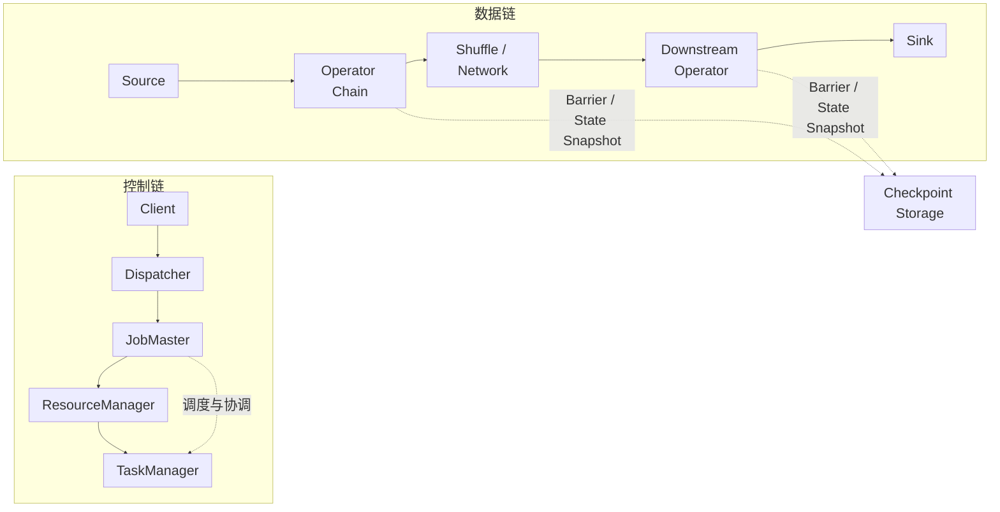
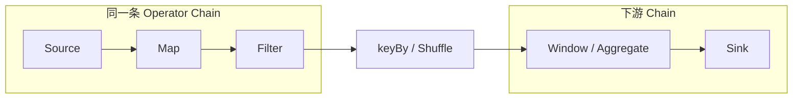
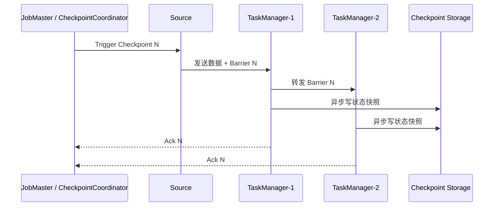

## 1. 架构主线

理解 Flink，先抓住一条主线：**用户代码在 Client 侧生成执行计划，计划提交到集群后，由 JobMaster 调度 TaskManager 上的并行子任务执行，状态与 Checkpoint 贯穿整个运行时。**

### 1.1 控制链与数据链

Flink 架构可以拆成 3 条同时存在的链路：

1. **控制链**
   Client 负责编译并提交作业，Dispatcher 接收作业，JobMaster 负责调度，ResourceManager 负责资源，TaskManager 负责执行。
2. **数据链**
   数据从 Source 进入，经过 Operator Chain、本地处理或网络 Shuffle，再流向下游算子与 Sink。
3. **状态链**
   Keyed State、Operator State、Checkpoint Barrier 与外部存储一起构成容错链路。



**观察重点**

- 控制链解决“谁来接收、调度、容错”。
- 数据链解决“数据如何在算子之间流动”。
- 状态链解决“失败后如何恢复到一致状态”。

---

### 1.2 一次作业的完整路径

一次典型的 Flink 作业通常经过下面 8 步：

1. 用户编写 `DataStream` 或 `Table` 程序。
2. 调用 `execute()` 后，Client 把逻辑转换成 `StreamGraph`。
3. Flink 对图做优化，生成 `JobGraph`。
4. Client 上传 JAR、依赖和作业描述，提交给 Dispatcher。
5. Dispatcher 为作业创建对应的 `JobMaster`。
6. `JobMaster` 构建运行时图，向 `ResourceManager` 申请 slot。
7. `TaskManager` 接收部署命令，启动并行子任务执行。
8. Source 持续推送数据，Checkpoint 周期性落盘，失败时按最新快照恢复。

```text
用户代码 -> StreamGraph -> JobGraph -> Dispatcher -> JobMaster
        -> Slot 申请 -> Task 部署 -> 数据流动 -> Checkpoint / 恢复
```

**记忆方式**

- `Graph` 解决“怎么描述计划”。
- `Master` 解决“怎么调度执行”。
- `TaskManager` 解决“谁真正跑代码”。

---

## 2. 核心组件与概念边界

### 2.1 Master 侧与 Worker 侧角色

| 概念 | 所在位置 | 主要职责 | 关键特点 |
| --- | --- | --- | --- |
| Client | 提交端 | 解析用户程序、生成计划、提交作业 | 不负责长期运行作业 |
| Dispatcher | Master 侧 | 接收提交请求、管理作业入口、提供 REST/UI 接口 | 更像“作业接待台” |
| ResourceManager | Master 侧 | 管理 TaskManager 注册与 slot 资源 | 面向资源，不直接跑业务算子 |
| JobMaster | Master 侧 | 负责单个作业的调度、Checkpoint、故障恢复 | 一个作业一个 JobMaster |
| TaskManager | Worker 侧 | 执行 task、管理本地网络缓冲和状态 | 真正运行用户算子代码 |

**边界结论**

- `Dispatcher` 负责“收作业”。
- `ResourceManager` 负责“管资源”。
- `JobMaster` 负责“盯某个作业从头跑到尾”。
- `TaskManager` 负责“真正干活”。

---

### 2.2 JobManager、JobMaster、TaskManager 的区别

这几个名字最容易混淆，可以直接按下面方式记：

1. **JobManager**
   通常指 Flink 集群中的 Master 进程或 Master 节点，是一个更偏“进程级”的叫法。
2. **JobMaster**
   是某个具体作业的协调者，负责该作业的调度、状态管理和故障恢复。
3. **TaskManager**
   是 Worker 进程，负责执行并行 task，并持有 slot、网络缓冲和部分本地状态。

**最实用的理解方式**

- `JobManager` 更像“总控节点/总控进程”。
- `JobMaster` 更像“单个作业的项目经理”。
- `TaskManager` 更像“执行工人”。

---

### 2.3 Operator、Task、SubTask、Slot 的区别

| 概念 | 所属层次 | 定义 | 常见误区 |
| --- | --- | --- | --- |
| Operator | 逻辑层 | 一个算子节点，如 `map`、`filter`、`window`、`sink` | 不是资源单位 |
| SubTask | 并行层 | 某个 operator 的一个并行执行实例 | 经常被误当成 slot |
| Task | 运行时层 | TaskManager 内实际部署的执行单元，通常承载一个 subtask 或一条 operator chain | 和 operator 不是一一对应 |
| Slot | 资源层 | TaskManager 划分出的逻辑资源配额 | 不等于 CPU 核数，也不等于线程 |

**一个简单例子**

假设作业链路是：

```text
source -> map -> keyBy -> window -> sink
```

并行度设置为 `4`，则通常有下面几层关系：

- 逻辑上有多个 operator；
- 每个 operator 会展开成 4 个 subtask；
- 相邻 operator 可能被 chain 成更少的 runtime task；
- 这些 task 最终被放进 TaskManager 的 slot 中运行。

**关键区别**

- `operator` 看“逻辑语义”。
- `subtask` 看“并行实例”。
- `task` 看“实际部署对象”。
- `slot` 看“资源配额”。

---

## 3. 计划生成与作业提交

### 3.1 从用户代码到 JobGraph

下面这段代码足够体现 Flink 提交链路的起点：

```java
StreamExecutionEnvironment env = StreamExecutionEnvironment.getExecutionEnvironment();
env.enableCheckpointing(10000);

DataStream<String> lines = env.fromElements(
    "a flink",
    "a spark",
    "flink flink"
);

SingleOutputStreamOperator<Tuple2<String, Integer>> counts =
    lines.flatMap((String line, Collector<Tuple2<String, Integer>> out) -> {
            for (String word : line.split(" ")) {
                out.collect(Tuple2.of(word, 1));
            }
        })
        .returns(Types.TUPLE(Types.STRING, Types.INT))
        .keyBy(value -> value.f0)
        .sum(1);

counts.print();

env.execute("flink-arch-demo");
```

调用 `execute("flink-arch-demo")` 之前，大多数 `DataStream` API 只是**描述计算逻辑**；真正触发提交的是 `execute()`。

提交前后主要发生三件事：

1. 把用户 API 调用转换为 `StreamGraph`。
2. 对图做优化，例如 operator chain、partition 策略、slot sharing group。
3. 生成可提交的 `JobGraph`，并把作业名称、依赖、配置一起提交到集群。

**观察重点**

- `StreamGraph` 更接近“用户写出来的逻辑图”。
- `JobGraph` 更接近“Flink 优化后的可执行图”。

---

### 3.2 StreamGraph、JobGraph、ExecutionGraph 的区别

| 概念 | 生成时机 | 关注点 | 典型内容 |
| --- | --- | --- | --- |
| StreamGraph | `execute()` 触发后 | 用户逻辑如何连接 | source、transform、sink 的逻辑拓扑 |
| JobGraph | 提交前 | 如何优化与部署 | operator chain、分区策略、slot sharing |
| ExecutionGraph | 运行时 | 如何按并行度展开执行 | execution vertex、attempt、状态迁移 |

可以把三者理解成 3 个视角：

1. **StreamGraph**
   解决“你写了什么逻辑”。
2. **JobGraph**
   解决“Flink 打算怎么执行”。
3. **ExecutionGraph**
   解决“集群当前跑成什么样了”。

---

### 3.3 提交模式与适用场景

Flink 常见提交模式有 3 类：

1. **Session Mode**
   多个作业共用一个长生命周期集群，适合开发测试、多个轻量任务复用同一套集群。
2. **Per-Job Mode**
   一个作业对应一个独立集群，隔离性更强，适合重要任务和资源边界清晰的场景。
3. **Application Mode**
   用户的 `main()` 在集群侧运行，客户端更轻，适合依赖多、提交端较弱或云原生部署场景。

```bash
# Per-Job 模式
bin/flink run -t yarn-per-job -c com.demo.ArchJob app.jar

# Application 模式
bin/flink run-application -t yarn-application -c com.demo.ArchJob app.jar
```

**补充说明**

- 无论底层资源来自 Standalone、YARN 还是 Kubernetes，`JobGraph -> 调度 -> TaskManager 执行` 这条主线基本不变。
- Application Mode 的关键区别不在“算子如何执行”，而在“用户程序在哪一侧完成构图与提交”。
- 用户 JAR、依赖和 artifacts 通常会先上传，再由集群侧分发到需要执行 task 的节点。

---

## 4. 调度与运行细节

### 4.1 JobMaster 如何把图真正跑起来

`JobMaster` 接手 `JobGraph` 后，核心流程通常是：

1. 构建运行时执行图，并按并行度展开 execution vertices。
2. 根据 slot sharing、co-location、region 等约束计算调度计划。
3. 向 `ResourceManager` 申请可用 slot。
4. 将 task deployment descriptor 下发给对应的 `TaskManager`。
5. `TaskManager` 加载用户代码、初始化 operator、建立上下游网络通道。
6. task 状态从 `CREATED` 依次进入 `SCHEDULED`、`DEPLOYING`、`INITIALIZING`、`RUNNING`。
7. 运行过程中如果失败，按 failover 策略重启受影响区域并恢复状态。

**一个重要细节**

- Flink 不是“整图一次性全部拉起再一起跑”。
- 在流式场景下，很多边是 `pipelined` 的，上下游 task 建好通道后可以持续推送数据。

---

### 4.2 Operator Chain、Shuffle 与数据流动

相邻算子如果满足条件，Flink 会把它们 chain 到同一个 task 中，以减少：

- 序列化/反序列化开销；
- 线程切换开销；
- 网络传输开销。

但一旦遇到需要重分区的边，例如 `keyBy`、`rebalance`、`rescale`，往往就会打断 chain，形成网络传输边。



**运行时效果**

1. `Source -> Map -> Filter` 可能在同一个线程链中执行。
2. `keyBy` 之后需要按 key 重分布数据，通常会经过网络层。
3. 下游 `Window / Aggregate -> Sink` 可以再次形成新的 operator chain。

---

### 4.3 并行度、Slot Sharing 与反压

这 3 个概念最好一起看：

1. **并行度**
   决定某个 operator 有多少个 subtask。
2. **Slot Sharing**
   决定不同 task 是否可以共享同一个 slot，减少总 slot 需求。
3. **反压**
   下游处理慢导致缓冲区写满，压力沿链路向上游传播。

**容易踩坑的点**

- 并行度 `8` 不等于必须有 `8` 台机器，也不等于必须有 `8` 个 TaskManager。
- 一个 slot 可以承载多个来自同一 slot sharing group 的 task。
- 看到反压时，不一定是 CPU 满了，也可能是：
  - 下游写外部系统慢；
  - 网络缓冲不足；
  - 单个 key 热点导致数据倾斜；
  - checkpoint 对齐时间过长。

**排查顺序**

1. 先看 Web UI 中哪个算子最先出现反压。
2. 再看该算子的吞吐、busy time、backpressured time。
3. 最后看外部依赖、数据倾斜和 checkpoint 指标。

---

## 5. 状态、Checkpoint 与恢复机制

### 5.1 Keyed State 与 Operator State

Flink 的状态主要分成两类：

1. **Keyed State**
   先经过 `keyBy`，状态按 key 维度隔离，适合计数、聚合、会话、用户画像等场景。
2. **Operator State**
   不按 key 切分，而是归属于 operator/subtask，适合 source offset、规则分片、广播配置等场景。

**区别核心**

- `Keyed State` 强调“同一个 key 的历史上下文”。
- `Operator State` 强调“某个算子实例自己的状态”。

---

### 5.2 Checkpoint 与 Savepoint

这两个词都和“状态快照”有关，但目的不同：

| 概念 | 触发方式 | 主要目的 | 典型场景 |
| --- | --- | --- | --- |
| Checkpoint | 系统周期性触发 | 故障恢复 | 日常生产容错 |
| Savepoint | 用户手动触发 | 运维迁移与版本升级 | 停机升级、改作业参数、迁移集群 |

**结论**

- `Checkpoint` 是“自动安全带”。
- `Savepoint` 是“手动存档点”。

---

### 5.3 Checkpoint 如何贯穿运行时

配置 checkpoint 的代码通常像下面这样：

```java
StreamExecutionEnvironment env = StreamExecutionEnvironment.getExecutionEnvironment();

env.enableCheckpointing(10000);
env.getCheckpointConfig().setMinPauseBetweenCheckpoints(5000);
env.getCheckpointConfig().setCheckpointTimeout(60000);
env.getCheckpointConfig().setTolerableCheckpointFailureNumber(3);
```

一次 checkpoint 的关键动作通常是：

1. `JobMaster` 触发 checkpoint。
2. Source 注入 barrier。
3. Barrier 随数据流向下游传播。
4. 各个 operator 在一致位置截取状态快照。
5. 状态被异步写入 checkpoint storage。
6. 所有 task 确认成功后，这次 checkpoint 才算 completed。



**恢复时会发生什么**

- `JobMaster` 选择最近一次 completed checkpoint。
- 受影响 task 重启。
- 每个 subtask 从对应状态重新加载。
- Source 从对齐位置继续读取，尽量保证一致性语义。

---

## 6. 总结

### 6.1 高频混淆点

1. **JobManager 和 JobMaster 不是一回事**
   前者更偏进程/节点，后者更偏单作业协调角色。
2. **Slot 和 SubTask 不是一回事**
   前者是资源配额，后者是并行执行实例。
3. **JobGraph 和 ExecutionGraph 不是一回事**
   前者是提交前的可执行计划，后者是运行时展开后的调度视图。
4. **Checkpoint 和 Savepoint 不是一回事**
   前者面向自动容错，后者面向人工运维。
5. **Operator 和 Task 不是一回事**
   前者是逻辑算子，后者是部署到 TaskManager 的运行单元。

---

### 6.2 主线总结

1. 用户代码在 Client 侧定义逻辑，`execute()` 触发真正提交。
2. Flink 先把程序变成 `StreamGraph`，再优化成 `JobGraph`。
3. Dispatcher 接收作业，JobMaster 负责单作业调度，ResourceManager 负责资源。
4. TaskManager 持有 slot 并执行 task，多个 operator 可能被 chain 到同一个 task。
5. `keyBy`、`rebalance` 等重分区操作会改变数据流向，并可能打断 chain。
6. Checkpoint 贯穿运行时，决定作业在失败后能否从一致状态恢复。
7. 理解 Flink 架构，关键不是记名词，而是把“计划生成、资源调度、数据流动、状态恢复”串成一条线。
