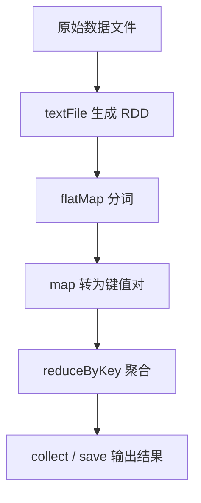
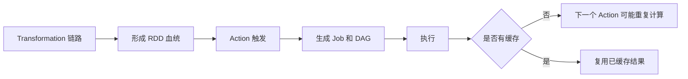
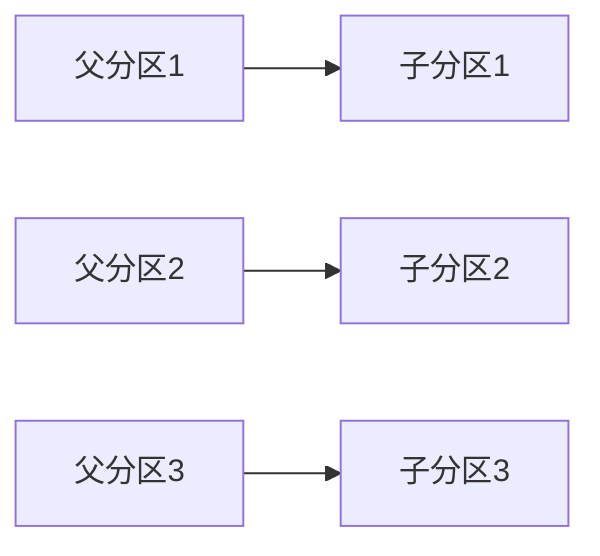
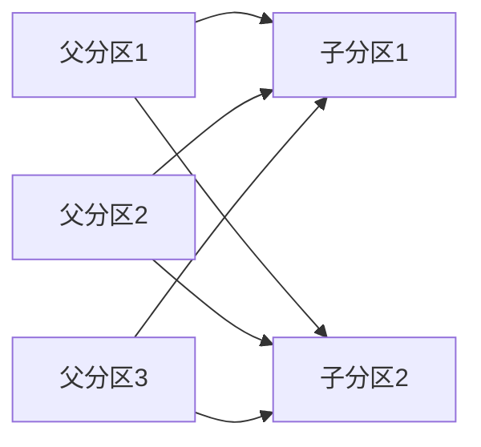
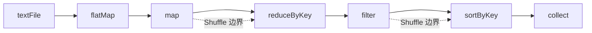
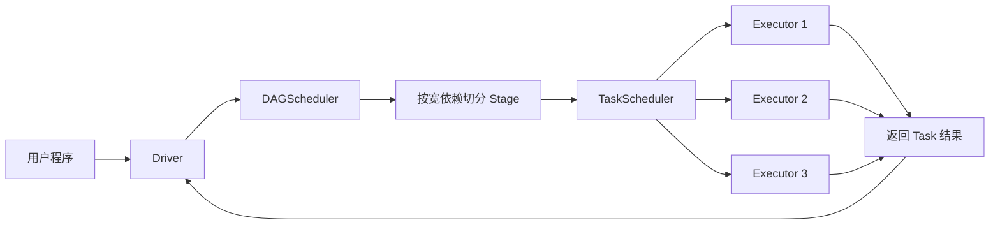
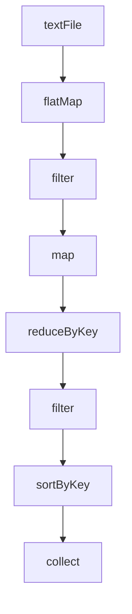
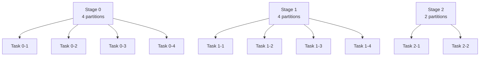

Spark 的运行机制经常被概括成一句话：“基于 DAG 进行计算”。这句话本身没有问题，但如果继续追问：

* DAG 到底是什么？
* DAG 是什么时候生成的？
* Stage 为什么总和 Shuffle 绑定在一起？
* Task 是怎么从 Stage 里拆出来的？
* 为什么一个 `count()`、一个 `collect()` 可能让前面的链路重复执行？

很多人就会开始混淆 `RDD`、`DAG`、`Job`、`Stage` 和 `Task` 的边界。

真正理解 Spark，不是记住几个术语，而是把下面这条主线串起来：

> **Spark 会先根据 RDD 血统关系构建 DAG，再按宽依赖切分 Stage，最后按分区把 Stage 拆成 Task 交给 Executor 并行执行。**

本文围绕这条主线展开，用更正式的结构、可运行代码和流程图，把 Spark DAG 执行机制讲清楚。

---

## 1. DAG 的定位：Spark 为什么不按“写一行跑一行”执行

从表面上看，Spark 程序就是一连串 API 调用：

```scala
val rdd = sc.textFile("input")
val words = rdd.flatMap(_.split(" "))
val pairs = words.map((_, 1))
val counts = pairs.reduceByKey(_ + _)
val result = counts.collect()
```

如果按传统命令式程序去理解，很容易觉得 Spark 的执行顺序一定是：

1. 读取文件；
2. 执行 `flatMap`；
3. 执行 `map`；
4. 执行 `reduceByKey`；
5. 最后执行 `collect`。

但 Spark 真正的执行模型并不是“写一行跑一行”，而是“先记录计算逻辑，再统一生成执行计划”。其原因主要有三点：

1. **便于全局优化**
   Spark 需要先看到完整计算链路，才知道哪些转换可以串起来执行，哪些地方必须打断。
2. **便于阶段切分**
   只有分析出依赖关系，才能知道哪里会发生 Shuffle，哪里应该切 Stage。
3. **便于容错恢复**
   Spark 通过记录血统关系，在节点失败时可以重算丢失分区，而不是整个任务全部重来。

因此，DAG 在 Spark 中不是一个“附带概念”，而是执行引擎的基础结构。

### 1.1. 什么是 DAG

DAG 全称是 **Directed Acyclic Graph**，即**有向无环图**。

在 Spark 里，它表示的是：

1. **计算步骤之间的依赖方向**
2. **RDD 之间的父子关系**
3. **一段计算逻辑从输入到输出的完整路径**

可以把它理解成一张“执行地图”：

* 节点代表某个 RDD 或某个逻辑处理阶段；
* 边代表依赖关系；
* 整张图描述了结果是如何一步步从原始数据推导出来的。



需要特别强调的是：

> **DAG 不是最终执行单位，而是 Spark 用来组织执行计划的逻辑图。**

它后面还会被继续切分为 Stage 和 Task。

### 1.2. DAG 与 RDD 血统的关系

Spark 中 DAG 的基础来自 **RDD lineage（血统）**。

所谓血统，就是“当前 RDD 是由哪些父 RDD 通过什么转换得到的”。

例如：

```scala
val rdd1 = sc.textFile("input")
val rdd2 = rdd1.filter(_.nonEmpty)
val rdd3 = rdd2.map(_.toLowerCase)
val rdd4 = rdd3.flatMap(_.split(" "))
```

这里的血统关系就是：

* `rdd2` 依赖 `rdd1`
* `rdd3` 依赖 `rdd2`
* `rdd4` 依赖 `rdd3`

从图上看，大致如下：

```text
rdd1 -> rdd2 -> rdd3 -> rdd4
```

这条血统链在逻辑上就是 DAG 的最基本形态。

---

## 2. DAG 的生成机制：Transformation 记录血统，Action 触发执行

理解 Spark DAG 的第一关键点，是搞清楚 **Transformation** 和 **Action** 的职责边界。

### 2.1. Transformation 的本质：定义计算，而不是立刻求值

以下操作都属于 Transformation：

* `map`
* `flatMap`
* `filter`
* `mapPartitions`
* `reduceByKey`
* `join`

它们的共同特点是：

> **只定义“如何从旧 RDD 生成新 RDD”，并不立即触发真正计算。**

示例：

```scala
val rawRDD = sc.textFile("hdfs:///data/logs.txt")
val cleanedRDD = rawRDD.filter(_.nonEmpty)
val lowerRDD = cleanedRDD.map(_.toLowerCase)
val pairRDD = lowerRDD.flatMap(_.split(" ")).map((_, 1))
val countRDD = pairRDD.reduceByKey(_ + _)
```

上面的代码执行完之后，Spark 并没有立即把整个文件都跑完。此时它主要完成的是：

1. 创建 RDD 对象；
2. 记录每个 RDD 的父依赖；
3. 把整个计算链保存为血统关系。

这个阶段可以理解为“画施工图”，而不是“真的开始施工”。

### 2.2. Action 的本质：告诉 Spark “我现在真的要结果”

常见 Action 包括：

* `count`
* `collect`
* `take`
* `foreach`
* `saveAsTextFile`

例如：

```scala
val total = countRDD.count()
```

这句代码一出现，Spark 才真正进入执行阶段。原因很简单：

* 前面的 Transformation 只是定义了“怎么做”；
* Action 才明确提出“现在给我结果”。

这时 Spark 才会：

1. 根据最终 RDD 反向追溯父依赖；
2. 构建完整 DAG；
3. 分析宽窄依赖；
4. 切分 Stage；
5. 生成 Task 并调度执行。

### 2.3. 为什么多个 Action 可能重复计算

这是面试和生产中都非常高频的一个问题。

```scala
val countRDD = pairRDD.reduceByKey(_ + _)

val a = countRDD.count()
val b = countRDD.collect()
```

很多人以为：

1. `count()` 已经算过了；
2. `collect()` 应该复用上一次结果。

实际上，如果没有缓存，Spark 很可能会把前面的链路再跑一遍。因为：

* RDD 默认保存的是“血统”和“计算方式”；
* 不是自动持久化的物化结果；
* 每个 Action 都可能触发一个新的 Job。

解决方式就是显式缓存：

```scala
val cachedRDD = countRDD.cache()

val a = cachedRDD.count()
val b = cachedRDD.collect()
```

因此可以记住一句非常重要的话：

> **Transformation 负责构图，Action 负责启动；缓存负责避免重复走图。**



---

## 3. Stage 切分原理：宽依赖是边界，Shuffle 是代价

Spark 并不会直接拿着一整张 DAG 去执行，而是会先把 DAG 切成多个 Stage。这里最关键的依据，就是依赖类型。

### 3.1. 窄依赖：适合流水线执行

窄依赖（Narrow Dependency）指的是：

> **父 RDD 的一个分区，最多只会被子 RDD 的一个分区使用。**

常见窄依赖操作包括：

* `map`
* `filter`
* `flatMap`
* `mapPartitions`
* `union`（很多场景下也可视作窄依赖）

示意图如下：



窄依赖的特点是：

1. 数据本地性较好；
2. 通常不需要跨节点重分发；
3. 多个窄依赖操作可以合并到同一个 Stage 中连续执行。

### 3.2. 宽依赖：意味着数据需要重分布

宽依赖（Wide Dependency）指的是：

> **子 RDD 的一个分区依赖于父 RDD 的多个分区。**

常见宽依赖操作包括：

* `reduceByKey`
* `groupByKey`
* `sortByKey`
* `join`
* `distinct`

示意图如下：



这类依赖会引出 Spark 中最昂贵的一类操作：**Shuffle**。

Shuffle 之所以昂贵，是因为它通常伴随：

1. 网络传输；
2. 磁盘写读；
3. 重新排序；
4. 新的 Stage 边界。

### 3.3. Stage 为什么通常以 Shuffle 为边界

Spark 切分 Stage 时有一个非常重要的原则：

> **一串连续的窄依赖可以放进同一个 Stage；一旦遇到宽依赖，通常就要切出新的 Stage。**

看下面这个经典链路：

```scala
val rdd1 = sc.textFile("input")
val rdd2 = rdd1.flatMap(_.split(" "))
val rdd3 = rdd2.map((_, 1))
val rdd4 = rdd3.reduceByKey(_ + _)
val rdd5 = rdd4.filter(_._2 > 10)
val rdd6 = rdd5.sortByKey()
val result = rdd6.collect()
```

它的 Stage 划分大致如下：

1. **Stage 0**
   `textFile -> flatMap -> map`
2. **Stage 1**
   `reduceByKey -> filter`
3. **Stage 2**
   `sortByKey -> collect`

原因在于：

* `reduceByKey` 前有一次 Shuffle
* `sortByKey` 前又有一次 Shuffle

所以会出现两处边界。



这一节最重要的结论是：

> **DAG 决定了“有哪些依赖”，宽依赖决定了“哪里切 Stage”。**

---

## 4. 调度链路：Job、Stage、Task、Driver、Executor 是如何串起来的

当 Action 触发执行后，Spark 并不是立刻“让所有节点一起跑”，而是会经过一条明确的调度链路。

### 4.1. Job、Stage、Task 的层级关系

这三个概念最容易被混淆，但其实是清晰的包含关系：

1. **Job**
   - 通常由一个 Action 触发；
   - 表示一次完整的计算任务。
2. **Stage**
   - 是 Job 内部按依赖切分出的调度阶段；
   - 通常以 Shuffle 为边界划分。
3. **Task**
   - 是 Stage 内部最小的执行单元；
   - 通常一个分区对应一个 Task。

可以用一句话概括：

> **一个 Action 触发一个 Job；一个 Job 被切成多个 Stage；一个 Stage 再拆成多个 Task。**

### 4.2. Driver、DAGScheduler、TaskScheduler、Executor 的职责

它们的职责可以分开记：

1. **Driver**
   - Spark 应用的控制中心；
   - 负责接收用户程序、协调调度、汇总结果。
2. **DAGScheduler**
   - 根据 RDD 血统构建 DAG；
   - 识别宽窄依赖；
   - 把 Job 切分成多个 Stage。
3. **TaskScheduler**
   - 把 Stage 进一步拆成 Task；
   - 按资源情况把 Task 分发出去。
4. **Executor**
   - 真正执行 Task；
   - 读数据、做计算、返回结果。

### 4.3. 一张图看懂完整执行链路



如果把调度顺序写成步骤，就是：

1. 用户代码提交给 Driver；
2. Action 触发 Job；
3. DAGScheduler 构建 DAG 并切 Stage；
4. TaskScheduler 根据 Stage 生成 Task；
5. Executor 并行执行 Task；
6. 结果逐层回传，直到 Job 完成。

### 4.4. 一个 Stage 为什么要等父 Stage 完成

这也是一个高频面试点。

考虑下面这个例子：

```scala
val rdd1 = sc.textFile("file1")
val rdd2 = sc.textFile("file2")
val rdd3 = rdd1.map(parseA)
val rdd4 = rdd2.map(parseB)
val rdd5 = rdd3.join(rdd4)
val result = rdd5.collect()
```

这里：

* `rdd3` 和 `rdd4` 所在 Stage 可以并行；
* 但 `join` 所在 Stage 必须等待前两个 Stage 都完成。

原因是 `join` 需要两边的数据都到齐之后才能完成匹配。

所以，Spark 的调度策略本质上是：

> **先满足依赖，再执行下游。**

---

## 5. 案例拆解：从代码到 DAG、再到 Stage 和 Task

下面用一个更完整的词频统计案例，把抽象原理真正落到代码和图上。

### 5.1. 示例代码

```scala
val linesRDD = sc.textFile("hdfs:///data/words.txt", minPartitions = 4)

val resultRDD = linesRDD
  .flatMap(_.split("\\s+"))
  .filter(_.nonEmpty)
  .map(word => (word.toLowerCase, 1))
  .reduceByKey(_ + _)
  .filter(_._2 >= 3)
  .sortByKey()

val result = resultRDD.collect()
```

这段代码背后其实包含了三个层次的结构。

### 5.2. 第一层：逻辑 DAG



这一层表达的是：

* 计算步骤有哪些；
* 步骤之间谁依赖谁；
* 最终结果从哪里来。

### 5.3. 第二层：Stage 划分

从依赖类型角度看：

1. `textFile -> flatMap -> filter -> map`
   这一串主要是窄依赖，可以放在同一个 Stage。
2. `reduceByKey`
   会产生 Shuffle，形成新的 Stage 边界。
3. `sortByKey`
   也会产生新的 Shuffle，再形成一个 Stage 边界。

因此可以拆成：

```text
Stage 0:
textFile -> flatMap -> filter -> map

Stage 1:
reduceByKey -> filter

Stage 2:
sortByKey -> collect
```

### 5.4. 第三层：Task 数量

假设：

* `linesRDD` 初始有 4 个分区；
* `reduceByKey` 后仍是 4 个分区；
* `sortByKey` 后调整成 2 个分区；

那么就可能得到：

1. Stage 0：4 个 Task
2. Stage 1：4 个 Task
3. Stage 2：2 个 Task

示意图如下：



这一节要形成的直觉是：

> **同一段代码，在 Spark 里至少可以从“逻辑 DAG”“Stage 划分”“Task 并行”三个层次去理解。**

### 5.5. 缓存为什么能改变执行成本

假设在上面的案例中，你接着又写了两个 Action：

```scala
val cached = resultRDD.cache()

val top10 = cached.take(10)
val total = cached.count()
```

没有缓存时：

* `take(10)` 可能跑一遍前面的 DAG；
* `count()` 又可能再跑一遍前面的 DAG。

有缓存后：

* 第一次 Action 会把中间结果物化；
* 后续 Action 可以直接复用缓存结果。

这也是为什么在生产环境里，判断“某个中间 RDD 是否会被复用”，比单纯背 API 更重要。

---

## 6. 工程视角下的优化重点与面试回答框架

理解 DAG 的价值，不只在于能把原理讲出来，更在于能指导你判断性能问题和回答面试问题。

### 6.1. 工程上最值得关注的优化点

结合 DAG 视角，最常见的优化重点有四类：

1. **减少不必要的 Shuffle**
   - 优先使用 `reduceByKey` 而不是 `groupByKey`
   - 不要无意义排序
   - 避免过多 `repartition`
2. **控制 Stage 数量**
   - 宽依赖过多，Stage 会变碎
   - Stage 越多，调度和等待成本越高
3. **合理控制分区数**
   - 分区太少，并行度不够
   - 分区太多，Task 调度成本上升
4. **缓存复用链路**
   - 多个 Action 反复访问同一中间结果时，优先考虑 `cache` / `persist`

对比示例：

```scala
// 开销更高：先 group 再聚合，Shuffle 数据量更大
val grouped = rdd.groupByKey().mapValues(_.sum)

// 更常见也更高效：Map 端先做局部聚合
val reduced = rdd.reduceByKey(_ + _)
```

### 6.2. 常见误区

下面这些误区非常常见：

1. **误区一：Action 单独形成一个 Stage**
   - 不一定。
   - Action 更准确地说是触发 Job，而不是天然就是 Stage 边界。
2. **误区二：一个程序只有一个 Job**
   - 不对。
   - 多个 Action 往往会触发多个 Job。
3. **误区三：Stage 和 Task 是同一层概念**
   - 不对。
   - Stage 是调度阶段，Task 是执行单元。
4. **误区四：DAG 只是画图概念**
   - 不对。
   - DAG 是 Spark 进行阶段切分、调度和容错的基础。

### 6.3. 一段适合面试的标准回答

如果面试官问：

> Spark DAG 执行机制是什么？

可以用下面这段回答：

> Spark 在执行时会先通过 Transformation 构建 RDD 血统关系，而不会立即触发计算。等遇到 Action 后，DAGScheduler 会从最终 RDD 反向追溯依赖，构建完整 DAG。接着 Spark 根据宽窄依赖切分 Stage，通常以 Shuffle 作为 Stage 边界。每个 Stage 再根据分区数拆分为多个 Task，由 TaskScheduler 调度到 Executor 上并行执行。多个父 Stage 完成后，下游 Stage 才能继续运行，最终结果回传给 Driver 或写入外部存储。

如果还想再补一句重点，可以这样收束：

> **Spark 的核心不是“固定两段式处理”，而是“先构图、再切阶段、再并行执行”。**

---

## 总结

理解 Spark DAG 执行机制，最重要的是把下面这条主线真正串起来：

1. Transformation 先记录血统，不立即执行；
2. Action 触发 Job；
3. DAGScheduler 根据依赖关系构建 DAG；
4. Spark 按宽依赖切分 Stage；
5. Stage 再按分区拆成多个 Task；
6. Task 被调度到 Executor 上并行执行；
7. 结果回传给 Driver，或写入外部存储。

如果把这条线吃透，很多看似零散的问题其实都会自然串起来：

* 为什么 Spark 要懒执行；
* 为什么 Shuffle 会这么贵；
* 为什么一个程序里会有多个 Stage；
* 为什么多个 Action 可能导致重复计算；
* 为什么缓存和分区策略对性能影响这么大。

最后用一句最凝练的话概括全文：

> **Spark DAG 的本质，是把一串数据转换操作组织成有依赖关系的执行图，再以 Shuffle 为边界切分 Stage，最终拆分成 Task 在集群上并行执行。**
