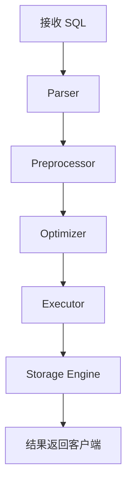

---
title: "MySQL 逻辑架构详解：连接层、SQL 层与存储引擎层"
categories: [05_大数据, 数据建模与SQL]
tags: [MySQL, 数据库, InnoDB, SQL优化]
layout: post
mermaid: true
---

MySQL 的逻辑架构可以概括为三层：连接层、SQL 层和存储引擎层。理解这三层的职责边界，有助于解释很多常见问题，例如连接数为什么会成为瓶颈、SQL 为什么没有走索引、InnoDB 为什么能够支持事务与崩溃恢复。

---

## 1. MySQL 整体逻辑架构

MySQL 并不是一个“单体执行器”，而是一套由多个模块协同完成请求处理的系统。从客户端发起连接到最终返回结果，大致会经历如下链路。

1. **连接层**
   - 负责网络通信、连接管理、认证授权和会话管理。
   - 主要解决“谁可以连进来、如何维护连接状态”的问题。
2. **SQL 层**
   - 负责 SQL 解析、预处理、优化和执行。
   - 主要解决“这条 SQL 应该如何执行”的问题。
3. **存储引擎层**
   - 负责数据的实际读写、索引组织、锁管理和事务支持。
   - 主要解决“数据如何落盘、如何保证一致性”的问题。


在生产环境中，最常见的组合通常是：

1. **连接层负责接入和权限控制**。
2. **SQL 层负责生成执行计划**。
3. **InnoDB 作为默认引擎负责落盘与事务控制**。

---

## 2. 连接层负责什么

连接层是 MySQL 与客户端交互的第一站。应用程序通过 JDBC、ODBC、命令行工具或 ORM 框架发出的请求，都会先进入这一层。

### 2.1. 连接建立的关键过程

1. **网络连接建立**
   - 支持 TCP/IP、Unix Socket，以及 Windows 命名管道等通信方式。
2. **用户认证**
   - 验证用户名、密码、来源主机等信息。
   - 如果校验失败，连接会在这一阶段被拒绝。
3. **权限初始化**
   - MySQL 会加载该会话对应的权限信息和默认环境。
4. **会话建立**
   - 会话变量、字符集、事务隔离级别等会和连接绑定。

```sql
SHOW VARIABLES LIKE 'max_connections';
SHOW PROCESSLIST;
```

上面两条命令分别可以帮助我们观察连接上限和当前连接使用情况。

### 2.2. 连接与线程的关系

1. **社区版 MySQL 的常见模型**
   - 通常是“一连接一线程”的处理方式。
   - 连接数越高，线程资源和上下文切换开销越大。
2. **线程池模式**
   - 某些商业版本、发行版或兼容实现会提供线程池能力。
   - 它的价值在于降低线程数量，提升高并发场景下的稳定性。

这里需要特别注意一点：**认证绑定在连接对象上，而不是绑定在某一个工作线程上**。线程池即使复用线程，也不会影响连接认证结果和会话上下文。

---

## 3. SQL 层如何处理一条查询

SQL 层是 MySQL 的“控制中枢”。当一条 SQL 进入系统后，通常会依次经过解析、预处理、优化和执行四个阶段。

### 3.1. SQL 处理流程

1. **Parser 解析器**
   - 对 SQL 进行词法分析与语法分析。
   - 生成内部可识别的语法树。
2. **Preprocessor 预处理器**
   - 检查表、列、别名是否存在。
   - 补充视图展开、权限检查等必要信息。
3. **Optimizer 优化器**
   - 评估是否使用索引、选择哪种访问路径、以什么顺序做 Join。
   - MySQL 使用基于成本的优化器（CBO）。
4. **Executor 执行器**
   - 按照执行计划向存储引擎发起读写请求。
   - 最终将结果集返回给客户端。



下面是一条典型的查询语句：

```sql
EXPLAIN
SELECT id, name
FROM user_info
WHERE phone = '13800000000'
  AND status = 1;
```

阅读 `EXPLAIN` 结果时，通常要重点关注以下信息：

1. **`type`**
   - 访问类型，越接近 `const`、`ref`、`range` 通常越好。
2. **`key`**
   - 实际使用了哪个索引。
3. **`rows`**
   - 优化器预估需要扫描的行数。
4. **`Extra`**
   - 是否出现 `Using filesort`、`Using temporary` 等额外代价。

---

## 4. 存储引擎层决定了数据如何读写

MySQL 的一个重要特点是插件式存储引擎架构。SQL 层向上暴露统一能力，但底层存储和事务语义由具体引擎实现。

### 4.1. 常见存储引擎

1. **InnoDB**
   - MySQL 8.x 默认存储引擎。
   - 支持事务、行级锁、MVCC、崩溃恢复和外键。
2. **MyISAM**
   - 早期较常见。
   - 不支持事务和行级锁，现在线上核心业务使用较少。
3. **Memory**
   - 数据保存在内存中，适合临时计算和会话型场景。
   - 服务重启后数据不会保留。

| 存储引擎 | 是否支持事务 | 锁粒度 | 典型特点 |
| --- | --- | --- | --- |
| InnoDB | 支持 | 行级锁 | 默认引擎，适合 OLTP |
| MyISAM | 不支持 | 表级锁 | 结构简单，历史包袱较重 |
| Memory | 不支持或能力有限 | 表级锁 | 速度快，但不持久化 |

查看表使用的存储引擎可以使用如下命令：

```sql
SHOW TABLE STATUS LIKE 'user_info';
```

如果是新建业务表，通常推荐显式指定 InnoDB：

```sql
CREATE TABLE user_info (
    id BIGINT PRIMARY KEY,
    name VARCHAR(64) NOT NULL,
    phone VARCHAR(20) NOT NULL,
    status TINYINT NOT NULL,
    created_at DATETIME NOT NULL,
    KEY idx_phone_status (phone, status)
) ENGINE=InnoDB;
```

---

## 5. InnoDB 为什么能成为默认引擎

在现代 MySQL 系统中，理解 InnoDB 基本就等于理解了大部分线上数据库行为。它之所以成为默认引擎，关键在于其事务、缓存和日志体系比较完整。

### 5.1. InnoDB 的几个核心组件

1. **Buffer Pool**
   - 用于缓存数据页和索引页。
   - 热数据优先在内存中访问，减少磁盘 I/O。
2. **Redo Log**
   - 用于保证已提交事务在故障后的持久性。
   - 采用 WAL（Write-Ahead Logging）思想。
3. **Undo Log**
   - 用于事务回滚和 MVCC。
   - 帮助不同事务看到一致性视图。
4. **Doublewrite Buffer**
   - 用于降低页写入过程中的部分写风险。
5. **聚簇索引**
   - 主键索引叶子节点直接保存整行数据。
   - 二级索引叶子节点保存主键值，再通过主键回表。


下面是一段典型的事务示例：

```sql
START TRANSACTION;

UPDATE account
SET balance = balance - 100
WHERE user_id = 1;

UPDATE account
SET balance = balance + 100
WHERE user_id = 2;

COMMIT;
```

这段 SQL 之所以能够保证“要么都成功，要么都失败”，依赖的就是 InnoDB 的事务日志和锁机制。

---

## 6. 从架构视角理解常见性能问题

很多性能问题，本质上都可以映射回这三层架构中的某一层。

### 6.1. 连接层问题

1. **连接数过高**
   - 可能导致线程切换频繁、内存开销增大。
2. **短连接过多**
   - 反复创建和释放连接，会增加认证与线程分配成本。
3. **连接池配置不合理**
   - 应用侧连接池过大，会把压力直接传递给数据库。

### 6.2. SQL 层问题

1. **没有走索引**
   - 导致全表扫描，放大 I/O 和 CPU 消耗。
2. **排序与临时表过多**
   - 常见于不合理的 `ORDER BY`、`GROUP BY` 或复杂子查询。
3. **优化器选错计划**
   - 可能与统计信息不准确、索引设计不合理有关。

### 6.3. 存储引擎层问题

1. **Buffer Pool 命中率低**
   - 说明热点数据没有被有效缓存。
2. **随机 I/O 过高**
   - 常见于无序写入、回表过多或大范围扫描。
3. **锁冲突严重**
   - 会表现为事务阻塞、超时和吞吐下降。

可以用下面这几条命令做基础排查：

```sql
EXPLAIN SELECT * FROM user_info WHERE phone = '13800000000';
SHOW ENGINE INNODB STATUS;
SHOW VARIABLES LIKE 'innodb_buffer_pool_size';
```

---

## 7. 总结

MySQL 的逻辑架构虽然常被概括为“三层”，但这三个层次分别回答了三个不同的问题：连接层决定请求如何进入系统，SQL 层决定语句如何执行，存储引擎层决定数据如何被安全、高效地读写。

如果从面试、排障和工程实践三个场景来理解，这套架构至少有三点值得重点掌握：

1. **连接层关注接入能力与资源上限**。
2. **SQL 层关注执行计划是否合理**。
3. **InnoDB 层关注事务、日志、缓存与锁机制**。

把这三层串起来，再去看慢 SQL、锁等待、连接数爆满和崩溃恢复等问题，分析路径通常会清晰很多。
