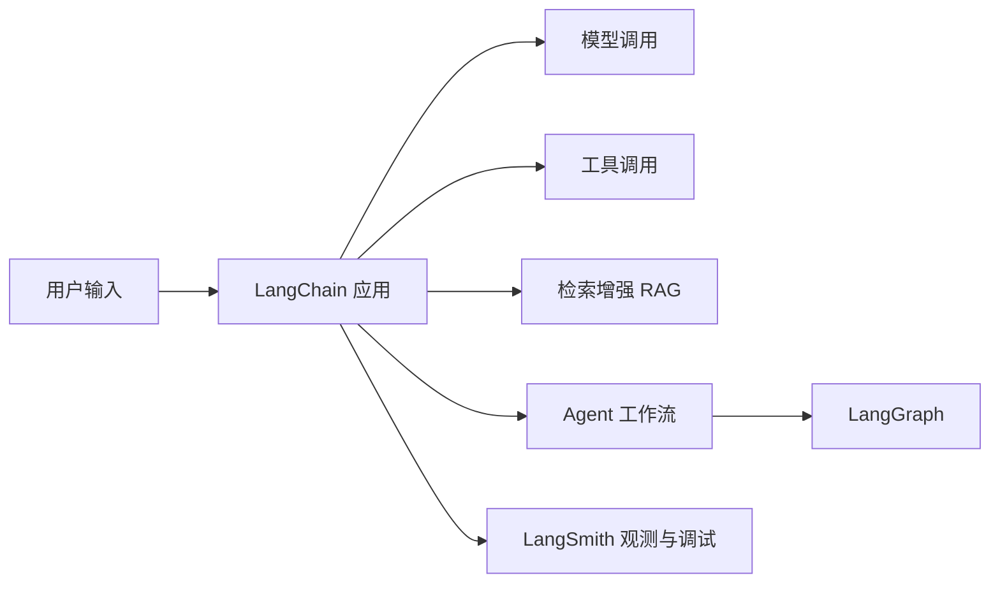
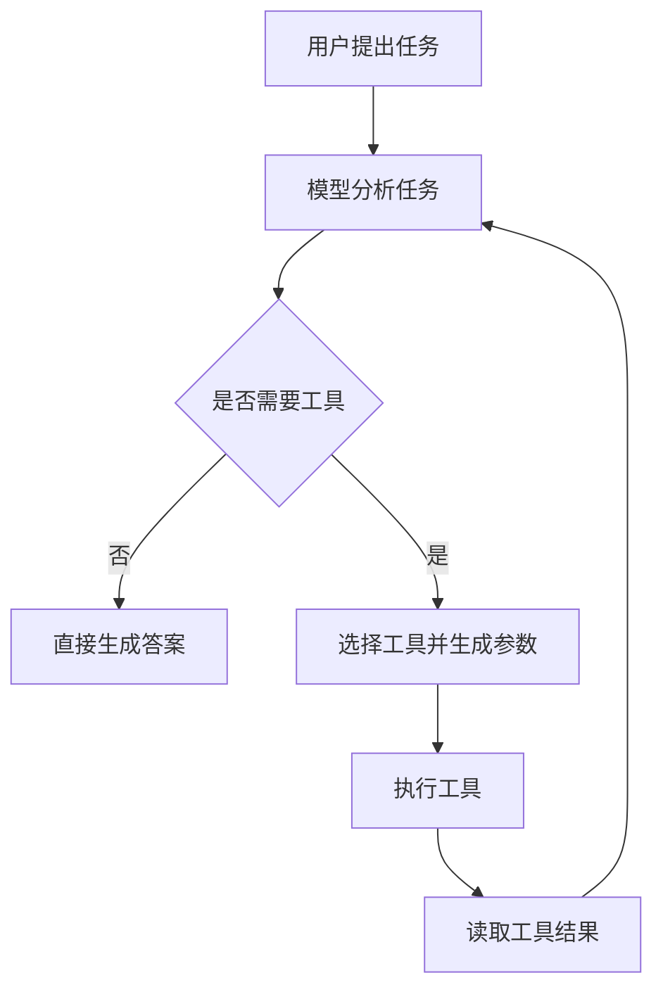
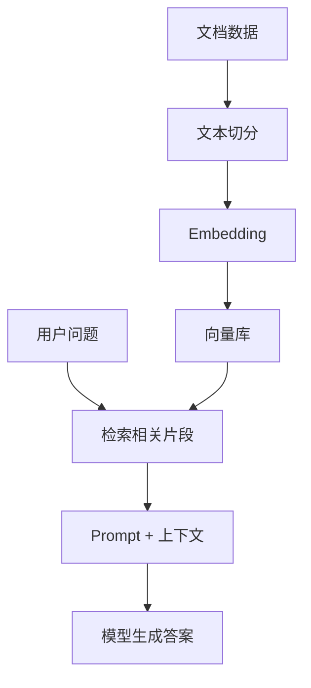

LangChain 是一个用于构建大语言模型应用的开源框架。它提供统一的模型接口、工具调用、Agent 架构、检索增强生成（RAG）以及大量生态集成，使开发者可以更快地把模型、工具、数据源和业务流程组合成可运行的 AI 应用。

直接调用模型 API 可以完成简单问答、摘要、翻译和内容生成。但当应用需要接入外部工具、检索私有知识库、维护多轮上下文、追踪执行链路时，单次 API 调用就会变得不够用。LangChain 的作用，就是把这些工程能力抽象成可组合的组件。

---

## 1. LangChain 是什么

从工程角度看，LangChain 主要解决三个问题：

* **统一模型接口**：不同模型供应商的 API 格式不同，LangChain 提供统一的调用方式，便于切换模型。
* **连接外部能力**：通过 Tool 机制，让模型能够调用函数、查询数据库、请求 API 或使用搜索服务。
* **组织复杂流程**：通过 Agent、RAG、流式输出、结构化输出、观测调试等能力，将模型调用扩展成完整应用。

一个典型 LangChain 应用可以理解为：



### 1.1. LangChain、LangGraph、LangSmith 的关系

这三个名字经常一起出现，但定位不同。

| 名称 | 定位 | 适用场景 |
| --- | --- | --- |
| LangChain | LLM 应用开发框架 | 模型调用、工具调用、Agent、RAG |
| LangGraph | 更底层的图编排框架 | 复杂状态流转、可恢复执行、多步骤 Agent |
| LangSmith | 调试、观测和评估平台 | Trace、Debug、Evaluation、线上监控 |

可以简单理解为：

* **LangChain** 用来快速搭建 LLM 应用。
* **LangGraph** 用来编排更复杂、更可控的执行流程。
* **LangSmith** 用来观察、调试和评估应用运行效果。

当前 LangChain 的 Agent 能力构建在 LangGraph 之上。如果只是入门，优先掌握 LangChain 的模型调用、Tool、Agent 和 RAG 即可。

---

## 2. 环境准备与第一个模型调用

### 2.1. 安装依赖

LangChain 核心包可以通过 `pip` 安装：

```bash
pip install -U langchain
```

LangChain 的模型供应商集成通常放在独立包中。以 OpenAI 为例，可以安装：

```bash
pip install -U langchain-openai
```

也可以使用 extra 形式安装：

```bash
pip install -U "langchain[openai]"
```

> LangChain 官方要求 Python 3.10+。如果使用 Anthropic、Google Gemini、Azure、Ollama 等模型，需要安装对应集成包并配置对应 API Key。

### 2.2. 初始化模型

LangChain 推荐使用 `init_chat_model` 初始化聊天模型：

```python
import os
from langchain.chat_models import init_chat_model

os.environ["OPENAI_API_KEY"] = "sk-..."

model = init_chat_model("openai:gpt-5.4-mini")
```

这里的模型标识符可以替换为你实际可用的模型。使用其他模型供应商时，需要同时替换模型名称、集成包和环境变量。

### 2.3. 执行一次调用

初始化模型后，可以直接使用 `invoke`：

```python
response = model.invoke("用一句话解释 LangChain 是什么。")
print(response.content)
```

可能得到类似输出：

```text
LangChain 是一个用于连接大语言模型、工具和数据源，从而构建 AI 应用的开发框架。
```

这一段代码展示了 LangChain 最基础的使用方式：初始化模型，然后向模型发送输入并读取输出。后续的 Prompt、Tool、Agent、RAG 都是在这个基础上继续扩展。

---

## 3. LangChain 核心组件

LangChain 的使用方式可以理解为“组件组合”。入门阶段不需要记住所有 API，但需要理解几个核心概念。

| 组件 | 作用 | 说明 |
| --- | --- | --- |
| Model | 调用大语言模型 | 负责文本生成、推理、工具选择等 |
| Message | 表示对话消息 | 常见角色包括 system、user、assistant |
| Prompt | 组织模型输入 | 把任务、上下文、约束拼成模型可理解的输入 |
| Tool | 暴露外部能力 | 让模型调用函数、数据库、API、搜索等 |
| Structured Output | 结构化输出 | 约束模型返回 JSON、对象或固定 schema |
| Streaming | 流式输出 | 适合聊天 UI、长文本生成和实时反馈 |

### 3.1. Model

Model 是 LangChain 应用的推理核心。它既可以单独调用，也可以放入 Agent 中负责决策。

```python
from langchain.chat_models import init_chat_model

model = init_chat_model("openai:gpt-5.4-mini")
response = model.invoke("列出三个 LangChain 的典型使用场景。")
print(response.content)
```

### 3.2. Message

聊天模型通常接收消息列表，而不是单纯字符串。消息角色可以帮助模型理解上下文。

```python
messages = [
    {"role": "system", "content": "你是一名 AI 应用开发讲师。"},
    {"role": "user", "content": "请解释 Tool Calling 的作用。"},
]

response = model.invoke(messages)
print(response.content)
```

### 3.3. Prompt

Prompt 用于描述任务目标、背景、约束和输出格式。对于复杂任务，不建议只传一句简单问题，而应该明确说明输入、输出和限制条件。

```python
prompt = """
你是一名技术博客作者。
请用 3 个要点解释 LangChain 的价值：
1. 每个要点不超过 30 字；
2. 面向初学者；
3. 使用 Markdown 列表输出。
"""

response = model.invoke(prompt)
print(response.content)
```

### 3.4. Tool

Tool 是 LangChain 中非常重要的抽象。它把一个普通函数包装成模型可调用的外部能力。

```python
from langchain.tools import tool

@tool
def multiply(a: int, b: int) -> str:
    """计算两个整数的乘积。"""
    return str(a * b)
```

工具函数应尽量满足三个要求：

* 使用清晰的函数名。
* 使用类型注解描述输入。
* 使用简洁准确的 docstring 说明工具用途。

这些信息会帮助模型判断什么时候该调用工具，以及应该传入什么参数。

---

## 4. 从函数到 Agent

普通模型调用只负责生成文本。Agent 则会在模型基础上增加“行动能力”：它可以根据目标判断是否需要调用工具，读取工具返回结果，并继续推进任务。

Agent 的典型执行过程如下：



### 4.1. 创建一个简单 Agent

下面示例把前面的 `multiply` 工具交给 Agent。用户提出计算问题时，Agent 可以选择调用工具，而不是只依赖模型自行计算。

```python
from langchain.agents import create_agent
from langchain.tools import tool

@tool
def multiply(a: int, b: int) -> str:
    """计算两个整数的乘积。"""
    return str(a * b)

agent = create_agent(
    model="openai:gpt-5.4-mini",
    tools=[multiply],
    system_prompt="你是一个严谨的助手。遇到计算问题时，优先使用工具。",
)

result = agent.invoke(
    {
        "messages": [
            {"role": "user", "content": "23 乘以 17 是多少？"}
        ]
    }
)

print(result["messages"][-1].content)
```

这个例子里，Agent 的关键点不在于乘法本身，而在于执行方式发生了变化：

* 模型先理解用户问题。
* 模型判断需要使用 `multiply` 工具。
* LangChain 执行工具函数。
* 模型基于工具结果组织最终回答。

### 4.2. 什么时候使用 Agent

Agent 适合处理需要动态决策的任务，例如：

* 不确定是否需要调用工具。
* 需要在多个工具之间选择。
* 需要根据中间结果继续执行。
* 任务步骤无法完全提前写死。

如果任务流程非常固定，例如“读取输入、套模板、调用模型、输出结果”，普通模型调用或固定链路通常更简单、更稳定。不要为了使用 Agent 而使用 Agent。

---

## 5. RAG：让模型基于外部知识回答

RAG（Retrieval Augmented Generation，检索增强生成）是 LangChain 最常见的应用场景之一。它解决的问题是：模型参数中没有你的私有知识，或者模型记忆不一定准确，需要先从外部知识库检索相关内容，再让模型基于检索结果回答。

RAG 通常分成两个阶段：

1. **Indexing**：离线处理文档，构建可检索索引。
2. **Retrieval and Generation**：在线接收用户问题，检索相关片段，再生成答案。



### 5.1. Indexing：构建索引

索引阶段通常包括文档加载、文本切分、向量化和写入向量库。

```python
from langchain_community.document_loaders import TextLoader
from langchain_text_splitters import RecursiveCharacterTextSplitter

loader = TextLoader("docs/langchain_intro.txt", encoding="utf-8")
docs = loader.load()

text_splitter = RecursiveCharacterTextSplitter(
    chunk_size=800,
    chunk_overlap=100,
)
splits = text_splitter.split_documents(docs)

# 这里的 vector_store 可以替换为 Chroma、FAISS、Milvus、PGVector 等实现
vector_store.add_documents(splits)
```

这段代码是 RAG 的骨架。真实项目中还需要选择 embedding 模型和向量库，例如 Chroma、FAISS、Milvus、Elasticsearch、PGVector 等。

### 5.2. Retrieval and Generation：检索并生成

在线查询阶段，先根据用户问题检索相关片段，再把片段作为上下文交给模型。

```python
question = "LangChain 适合解决什么问题？"
retrieved_docs = vector_store.similarity_search(question, k=3)

context = "\n\n".join(doc.page_content for doc in retrieved_docs)

prompt = f"""
请只根据给定上下文回答问题。
如果上下文中没有答案，请回答“不知道”。

上下文：
{context}

问题：
{question}
"""

response = model.invoke(prompt)
print(response.content)
```

这种方式适合流程简单、可控性要求高的知识库问答。

### 5.3. RAG Agent

另一种做法是把检索能力包装成 Tool，再交给 Agent。这样 Agent 可以在需要时主动检索。

```python
from langchain.agents import create_agent
from langchain.tools import tool

@tool
def retrieve_context(query: str) -> str:
    """从知识库中检索与问题相关的上下文。"""
    docs = vector_store.similarity_search(query, k=3)
    return "\n\n".join(doc.page_content for doc in docs)

agent = create_agent(
    model="openai:gpt-5.4-mini",
    tools=[retrieve_context],
    system_prompt=(
        "你可以使用检索工具获取知识库上下文。"
        "回答必须基于检索结果；如果检索结果不足，请说明不知道。"
    ),
)

result = agent.invoke(
    {"messages": [{"role": "user", "content": "LangChain 和 LangGraph 有什么区别？"}]}
)

print(result["messages"][-1].content)
```

RAG Chain 更适合固定问答流程，RAG Agent 更适合需要模型自主判断是否检索、如何检索、多次检索的场景。

---

## 6. 调试、观测与实践建议

LLM 应用和传统程序不同：同样的输入可能因为模型版本、上下文、工具结果、采样参数而产生不同输出。因此，调试和观测非常重要。

LangSmith 可以用于：

* 追踪一次请求经过了哪些步骤。
* 查看 Agent 是否调用了工具。
* 分析每一步输入、输出和耗时。
* 对不同 Prompt、模型和版本做评估。
* 监控线上应用质量。

常见配置方式如下：

```bash
export LANGSMITH_TRACING=true
export LANGSMITH_API_KEY="lsv2_..."
```

实践中建议遵循以下原则：

* **先简单后复杂**：先跑通模型调用，再引入 Tool、Agent、RAG。
* **固定流程不用 Agent**：流程明确时，普通函数编排通常更稳定。
* **工具权限要收敛**：工具应限制输入范围，避免让模型执行高风险操作。
* **RAG 要重视数据质量**：切分策略、召回质量和上下文格式会直接影响答案。
* **输出要做校验**：涉及 JSON、SQL、代码、金额、权限等场景时，不要完全信任模型输出。
* **记录执行链路**：复杂应用需要 trace，否则很难定位错误来自模型、Prompt、工具还是数据。

---

## 7. 总结

LangChain 的入门路径可以按以下顺序展开：

1. 学会使用统一模型接口完成一次模型调用。
2. 理解 Message、Prompt、Tool 等核心组件。
3. 使用 `create_agent` 构建具备工具调用能力的 Agent。
4. 使用 RAG 将模型连接到外部知识库。
5. 使用 LangSmith 做调试、观测和评估。
6. 在更复杂的工作流中进一步学习 LangGraph。

LangChain 适合快速构建 LLM 应用原型，也适合在复杂项目中连接模型、工具、数据源和工作流。对于初学者来说，最重要的不是一次性掌握所有模块，而是先建立清晰的工程地图：**模型负责生成与推理，工具负责连接外部能力，RAG 负责引入知识，Agent 负责动态决策，观测系统负责让应用可调试、可评估。**

---

## 参考资料

* [LangChain Overview](https://docs.langchain.com/oss/python/langchain/overview)
* [Install LangChain](https://docs.langchain.com/oss/python/langchain/install)
* [LangChain Models](https://docs.langchain.com/oss/python/langchain/models)
* [LangChain Agents](https://docs.langchain.com/oss/python/langchain/agents)
* [LangChain Tools](https://docs.langchain.com/oss/python/langchain/tools)
* [Build a RAG agent with LangChain](https://docs.langchain.com/oss/python/langchain/rag)
