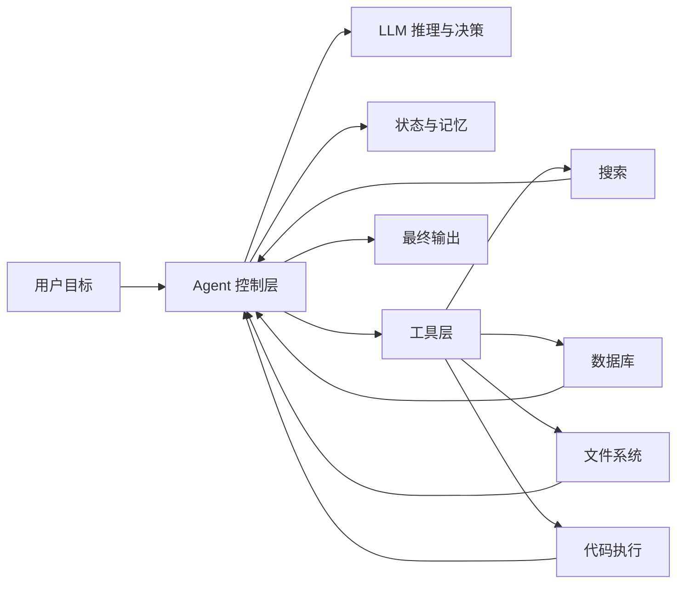
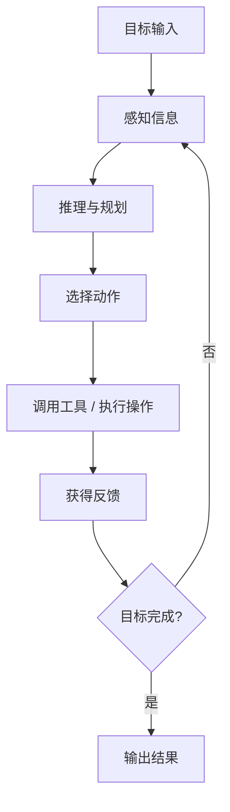

Agent 已经成为 AI 应用领域最常见的关键词之一，但它也是最容易被泛化的概念之一。有人把 Agent 等同于“会调用工具的大模型”，有人把 Agent 视为“自动执行任务的智能体”，还有人把工作流、自动化脚本、Copilot 全部归入 Agent。

这些说法各自抓住了一部分事实，但如果没有一个完整的概念框架，就很容易在介绍 Agent 时陷入“每句话都对，但整体讲不清”的状态。

本文希望解决的不是“定义背诵”问题，而是帮助读者建立一张完整的概念地图：看完后，你应该能够从宏观上把 Agent 相关概念串起来，并且比较有条理地向别人解释什么是 Agent、它为什么出现、它和大模型、工作流、多 Agent 协作之间分别是什么关系。

---

## 1. Agent 的基本定义与出现背景

### 1.1. 什么是 Agent

从工程角度看，Agent 可以概括为：

> **一种围绕目标持续推进任务、能够感知环境、调用工具、根据反馈调整行为的 AI 系统。**

这个定义里最重要的不是“智能”二字，而是以下四个关键词：

1. **目标驱动**
   Agent 不是随机生成内容，而是围绕一个任务目标工作。
2. **持续推进**
   它不是回答一次就结束，而是可以跨多个步骤完成任务。
3. **行动能力**
   它不仅能生成文本，还能调用工具、读写信息、执行操作。
4. **反馈闭环**
   它会根据执行结果修正后续行为，而不是只做一次静态输出。

因此，Agent 和普通聊天模型的差异，不在于“会不会说”，而在于：

> **它更像一个任务执行系统，而不只是一个文本生成系统。**

### 1.2. 为什么 Agent 会出现

早期大语言模型最典型的使用方式，是一轮输入对应一轮输出：

1. 用户提出问题；
2. 模型生成回答；
3. 对话结束。

这种模式适合：

* 问答
* 改写
* 翻译
* 摘要
* 单次代码生成

但在真实工作中，很多任务并不是“一问一答”能解决的。例如：

* 帮我分析系统报错并定位原因
* 帮我筛选十篇论文并整理研究方向
* 帮我根据一堆表格生成周报
* 帮我查航班、比较价格、输出出行方案

这类任务往往需要：

* 拆解目标
* 获取外部信息
* 使用工具
* 检查中间结果
* 根据反馈继续调整

于是，AI 系统开始从“回答问题”走向“完成任务”，这正是 Agent 出现的直接背景。

### 1.3. 一个直观的对比例子

假设用户说：

> “帮我整理这周项目进展，并输出一份周报。”

不同系统的行为可能是这样的：

* **聊天模型**
  直接生成一份通用周报模板。
* **工作流系统**
  按预设流程读取数据、汇总状态、拼接模板。
* **Agent**
  先判断缺少哪些信息，再读取文档或表格，必要时继续追问，最后生成周报，并根据你的反馈迭代修改。

这就是 Agent 的本质差异：它强调的是**任务推进能力**。

---

## 2. 从大模型到 Agent：系统层面究竟多了什么

### 2.1. 大模型不是 Agent，但常常是 Agent 的核心大脑

很多初学者容易把 Agent 和大语言模型混为一谈。更准确的说法是：

* **大语言模型（LLM）** 负责理解、推理、表达和生成；
* **Agent** 是在模型之外，再加上目标管理、工具使用、状态保持和执行控制之后形成的系统。

也就是说：

> **LLM 解决的是“怎么理解和生成”，Agent 解决的是“怎么围绕目标把事情做完”。**

### 2.2. 一个 Agent 系统通常包含哪些部件

一个比较完整的 Agent 系统，通常由下面几部分组成：

1. **模型**
   负责理解自然语言、进行推理和生成决策。
2. **上下文 / 状态**
   负责记录当前任务做到哪一步。
3. **工具层**
   负责连接搜索、浏览器、数据库、代码执行器、业务 API 等能力。
4. **规划与控制逻辑**
   负责决定先做什么、后做什么、什么时候停止。
5. **反馈机制**
   负责根据工具结果或用户反馈修正后续动作。

下面这张图可以帮助理解 Agent 的系统结构：



### 2.3. Agent 和传统自动化系统的边界

如果只看“会自动执行任务”这一点，Agent 很容易和自动化脚本混在一起。

但两者的差异在于：

* **自动化脚本**
  更强调固定规则和固定流程。
* **Agent**
  更强调根据上下文动态判断下一步动作。

比如：

* 自动化脚本像“照着流程表执行”
* Agent 更像“有目标、有判断、有调整能力的执行者”

当然，真实工程里它们经常结合出现，而不是非此即彼。

---

## 3. Agent 的核心工作机制：从目标到反馈闭环

如果只记一条主线，Agent 最值得记住的是下面这个闭环：

> **目标 -> 感知 -> 推理 -> 决策 -> 行动 -> 反馈**

### 3.1. 目标：为什么要做这件事

Agent 不是无目的输出，它首先需要明确：

* 任务是什么；
* 成功标准是什么；
* 当前缺了哪些信息。

例如：

* “输出一份周报”
* “找出销量最高的 10 个商品”
* “定位单元测试失败原因”

目标定义越清楚，Agent 越容易稳定执行。

### 3.2. 感知：从哪里获取信息

感知是 Agent 从外部环境中拿数据的过程。信息来源可能包括：

* 用户输入
* 文档
* 文件
* 网页
* 数据库
* API 返回结果
* 其他工具执行结果

如果没有这一步，Agent 只能依赖已有上下文“空想”。

### 3.3. 推理与决策：下一步做什么

推理阶段负责回答：

* 当前任务最合理的下一步是什么？
* 要不要先查资料？
* 要不要先问用户补充信息？
* 当前结果是否已经足够？

这个阶段通常由大语言模型承担。

### 3.4. 行动：真正发生的操作

行动阶段意味着 Agent 不再只是生成文本，而是开始做事，例如：

* 搜索网页
* 打开文件
* 查询数据库
* 执行代码
* 调用外部服务

很多人会说：

> **工具调用是 Agent 从“会说”走向“会做”的关键。**

这句话是成立的。

### 3.5. 反馈：根据结果继续调整

行动之后，Agent 会得到新的反馈，例如：

* 搜索结果是否相关
* 工具执行是否报错
* 数据是否缺失
* 用户是否满意

然后它再继续下一轮决策。

这意味着 Agent 的运行方式不是单向的，而是循环的。

下面这张图展示了这一点：



### 3.6. 一个最小 Agent 循环示例

下面这段代码不是生产级框架，而是帮助理解 Agent 的最小工作循环：

```python
def agent_loop(user_goal, tools, llm, max_steps=8):
    state = {
        "goal": user_goal,
        "history": [],
        "observations": []
    }

    for step in range(max_steps):
        prompt = {
            "goal": state["goal"],
            "history": state["history"],
            "observations": state["observations"]
        }

        decision = llm.decide(prompt)

        if decision["type"] == "finish":
            return decision["answer"]

        if decision["type"] == "tool_call":
            tool_name = decision["tool"]
            tool_args = decision["args"]
            result = tools[tool_name](**tool_args)

            state["history"].append(decision)
            state["observations"].append({
                "tool": tool_name,
                "result": result
            })

    return "任务未在限定步数内完成"
```

这段代码里，已经包含了 Agent 的几个关键概念：

* 有目标
* 有状态
* 有工具
* 有决策
* 有反馈循环

---

## 4. 几个最容易混淆的概念：Workflow、Memory、Planning、Tool Use

Agent 之所以容易被讲乱，一个重要原因是很多相关概念其实紧密耦合在一起。下面把最常见的几个概念逐一理清。

### 4.1. Agent 和 Workflow 的区别

Workflow 更像是**预先设计好的固定流程**。

例如：

1. 读取文档；
2. 提取关键词；
3. 生成摘要；
4. 输出结果。

它的特点是：

* 稳定
* 可控
* 易调试

Agent 则更强调**根据上下文动态决定下一步**。例如：

* 信息不够时先追问
* 搜索效果差时换关键词
* 工具报错时切换方案

更准确地说：

> **Workflow 提供确定性骨架，Agent 提供动态决策能力。**

现实中的系统往往是二者结合，而不是二选一。

### 4.2. Agent 和 Tool Use 的关系

没有工具，Agent 的行动能力会明显受限。

常见工具包括：

* 搜索工具
* 浏览器工具
* 文件读写工具
* 数据库工具
* 代码执行工具
* 日历、邮件、工单、消息系统接口

如果说大模型提供的是“语言智能”，那么工具提供的就是“外部行动能力”。

### 4.3. 什么是 Memory

Memory 不一定意味着“人格化长期记忆”，在工程实践里更常见的是三类：

1. **会话记忆**
   记录当前对话中已经说过什么。
2. **任务状态记忆**
   记录任务现在推进到了哪一步。
3. **长期记忆**
   记录跨会话的用户偏好、项目背景或经验数据。

它的核心价值是：

> **让 Agent 不是每一步都从零开始。**

### 4.4. 什么是 Planning

Planning 指的是把一个复杂目标拆成更容易执行的步骤。

例如：

“帮我调研 AI Agent 在企业中的应用场景，并整理成分享提纲。”

可以拆成：

1. 明确范围
2. 收集资料
3. 归类场景
4. 提炼共性
5. 输出提纲

因此，Planning 的意义在于：

* 降低复杂任务难度
* 提高执行稳定性
* 便于检查和纠错

### 4.5. 这些概念如何串成一个整体

如果把这几个概念合起来看，可以得到这样一条链路：

* **Workflow**
  决定整体骨架
* **Planning**
  负责步骤拆解
* **Tool Use**
  负责实际行动
* **Memory**
  负责状态延续
* **LLM**
  负责理解、推理和决策

换句话说：

> **Agent 往往不是某一个能力点，而是这些能力协同后的系统结果。**

---

## 5. 常见系统形态：单 Agent、多 Agent，以及它们和 Chatbot / Copilot 的关系

### 5.1. 单 Agent 与多 Agent

单 Agent 指的是一个 Agent 负责完成整个任务。

优点：

* 架构简单
* 成本较低
* 容易调试

缺点：

* 复杂任务可能让单个 Agent 负担过重

多 Agent 指的是将任务拆给多个角色化 Agent 协作，例如：

* 一个负责检索资料
* 一个负责代码分析
* 一个负责审核输出
* 一个负责汇总结果

优点：

* 角色边界清晰
* 复杂任务更容易分工

缺点：

* 系统复杂度更高
* 协作成本更高
* 调试难度更大

对于初学者而言，更实用的工程建议是：

> **能用单 Agent 做好的事情，不要一开始就引入多 Agent。**

### 5.2. Agent、Chatbot、Assistant、Copilot 的区别

这几个词经常混用，但关注点并不相同。

1. **Chatbot**
   更强调“对话形态”。
2. **Assistant**
   更强调“辅助用户完成任务”。
3. **Copilot**
   更强调“在特定工作场景中辅助人工作”。
4. **Agent**
   更强调目标驱动、工具调用、任务推进和反馈闭环。

可以用一张表概括：

| 概念 | 重点 | 是否一定具备行动能力 |
| --- | --- | --- |
| Chatbot | 对话 | 不一定 |
| Assistant | 辅助完成任务 | 不一定 |
| Copilot | 场景化辅助 | 视产品而定 |
| Agent | 目标驱动的任务执行 | 通常需要 |

这意味着：

* 不是所有 Chatbot 都是 Agent
* 不是所有 Copilot 都是 Agent
* 但它们都可能在内部使用 Agent 能力

### 5.3. 初学者最容易踩的几个认知误区

下面这些误区非常常见：

1. **Agent 不等于“大模型套壳”**
   仅仅把聊天模型放到网页里，并不自动等于 Agent。
2. **Agent 不等于自动化脚本**
   自动化脚本强调固定规则，Agent 强调动态决策。
3. **Agent 不等于完全自主**
   很多实际系统都会在人机协作、审批和风险控制上加入人工确认。
4. **Agent 的难点不只是模型能力**
   工具设计、状态管理、权限控制、成本控制、可观测性，同样是核心难点。

---

## 6. 如何把 Agent 讲清楚：一套适合对外介绍的表达框架

如果你需要向别人介绍 Agent，不建议一上来就堆术语。更好的方式是按下面这条线讲。

### 6.1. 第一层：先定义本质

先用一句话讲清楚：

> Agent 不是只会回答问题的 AI，而是能够围绕目标持续推进任务的 AI 系统。

### 6.2. 第二层：再解释为什么会出现

再补充背景：

> 因为很多真实任务不是一轮对话就能完成，而是需要多步推理、调用工具和根据反馈不断调整。

### 6.3. 第三层：再说明它比普通模型多了什么

可以继续说：

> 它通常比普通大模型多了目标管理、状态保持、工具使用、规划控制和反馈闭环这些能力。

### 6.4. 第四层：再讲它的工作方式

最推荐的说法是：

> Agent 的基本工作链路是：目标 -> 感知 -> 推理 -> 决策 -> 行动 -> 反馈。

### 6.5. 第五层：最后用例子收束

例如：

* 聊天模型像一个“会回答问题的人”
* Agent 更像一个“理解目标后能一步步把事情推进下去的执行者”

如果需要一个更完整的总结句，可以直接使用下面这个版本：

> **Agent 是建立在大语言模型等能力之上的任务执行系统，它围绕目标工作，能够感知环境、调用工具、进行规划和决策，并在反馈循环中持续推进任务完成。**

这句话已经把整篇文章的核心概念串起来了：

* 大模型
* 目标
* 工具
* 规划
* 记忆
* 决策
* 反馈闭环
* 任务完成

---

## 总结

理解 Agent 最重要的，不是记住多少术语，而是建立一条完整主线：

1. Agent 为什么出现：因为复杂任务不是一轮回答能解决的；
2. Agent 是什么：一种面向目标持续推进任务的 AI 系统；
3. Agent 比普通模型多了什么：状态、工具、规划、反馈闭环；
4. Agent 怎么工作：目标、感知、推理、决策、行动、反馈；
5. Agent 和 Workflow、Memory、Tool Use、多 Agent 的关系是什么；
6. Agent 和 Chatbot、Assistant、Copilot 的边界在哪里。

当你能够顺着这条线讲下来，Agent 相关概念就不再是零散的关键词，而会真正变成一张结构清晰的认知地图。
