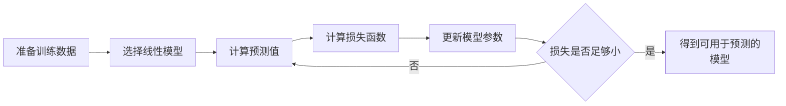

线性回归（Linear Regression）是机器学习中最基础、也最值得认真理解的模型之一。它的思想很朴素：**用一条直线，或者一个线性平面，去描述特征和目标值之间的关系**。

虽然线性回归看起来简单，但它包含了监督学习里非常核心的一套流程：建模、定义损失函数、学习参数、预测结果、评估效果。理解线性回归，后面再学习逻辑回归、岭回归、Lasso、神经网络里的损失函数与梯度下降，都会轻松很多。

---

## 1. 基本概念

线性回归属于**监督学习**中的**回归任务**。

监督学习的特点是：训练数据中既有输入特征，也有对应的真实答案。模型要从这些样本中学习规律，然后对新的样本做预测。

回归任务的目标是预测一个连续数值，例如：

* 根据房屋面积、楼层、位置预测房价。
* 根据广告投放金额预测销售额。
* 根据学习时长预测考试分数。
* 根据温度、湿度、风速预测用电量。

线性回归的核心假设是：**特征和目标值之间可以近似看成线性关系**。

例如只考虑房屋面积和房价时，可以认为面积越大，房价整体上越高。真实世界中的点不一定严格落在一条直线上，但线性回归会尝试找到一条“最合适”的直线，让这条线尽可能贴近所有样本点。


上图中，蓝色点表示真实样本，红色直线表示模型学到的预测规律。线性回归要做的事情，就是找到这条尽可能合理的线。

---

## 2. 模型表达

### 2.1. 单变量线性回归

当只有一个输入特征时，线性回归可以写成：

$$
\hat{y}=wx+b
$$

其中：

* $x$：输入特征，例如房屋面积。
* $\hat{y}$：模型预测值，例如预测房价。
* $w$：权重，也可以理解为斜率，表示 $x$ 增加时 $\hat{y}$ 的变化幅度。
* $b$：偏置，也可以理解为截距，表示当 $x=0$ 时模型的基础预测值。

如果把它画在二维坐标系中，它就是一条直线。模型训练的过程，本质上就是找到合适的 $w$ 和 $b$。

### 2.2. 多变量线性回归

真实问题中通常不止一个特征。例如预测房价时，可能会同时考虑面积、卧室数量、楼层、距离地铁站距离等。

多变量线性回归可以写成：

$$
\hat{y}=w_1x_1+w_2x_2+\cdots+w_nx_n+b
$$

其中：

* $x_1,x_2,\ldots,x_n$ 表示多个输入特征。
* $w_1,w_2,\ldots,w_n$ 表示每个特征对应的权重。
* $b$ 表示偏置项。

也可以写成更紧凑的向量形式：

$$
\hat{y}=\mathbf{x}^{T}\mathbf{w}+b
$$

向量形式并没有改变模型含义，只是把多个特征和多个权重的乘加过程写得更简洁。

---

## 3. 损失函数与参数拟合

线性回归不能只说“找一条合适的线”，还需要明确什么叫“合适”。

对每个样本来说，真实值是 $y_i$，预测值是 $\hat{y}_i$，两者之间的差值叫做**残差**：

$$
e_i=\hat{y}_i-y_i
$$

残差越小，说明模型预测越接近真实值。线性回归通常使用均方误差（Mean Squared Error，MSE）作为损失函数：

$$
J(\mathbf{w}, b)=\frac{1}{m}\sum_{i=1}^{m}(\hat{y}_i-y_i)^2
$$

其中：

* $m$ 表示样本数量。
* $\hat{y}_i$ 表示第 $i$ 个样本的预测值。
* $y_i$ 表示第 $i$ 个样本的真实值。
* $J(\mathbf{w}, b)$ 表示当前参数下的整体误差。

为什么要平方？

1. 平方后，正误差和负误差不会互相抵消。
2. 大误差会被放大，模型会更重视明显偏离的样本。
3. 平方函数连续可导，方便用数学方法求最优参数。

线性回归训练时，会尝试让所有这些误差的平方和尽可能小，这就是**最小二乘法**的核心思想。

$$
\min_{\mathbf{w},b}J(\mathbf{w},b)
$$

也就是找到一组参数 $\mathbf{w}$ 和 $b$，让整体预测误差最小。

常见求解思路有两类。

### 3.1. 正规方程

正规方程会直接通过矩阵运算求出最优解。在不单独拆出偏置项时，可以把偏置合并进特征矩阵，然后写成：

$$
\mathbf{w}=(X^{T}X)^{-1}X^{T}\mathbf{y}
$$

它的优点是：不需要设置学习率，也不需要迭代，理论上可以直接得到最优解。

但它也有局限：当特征数量很多时，矩阵求逆的计算成本会变高；如果 $X^{T}X$ 不可逆，还需要额外处理。

### 3.2. 梯度下降

梯度下降的思路更像“沿着误差变小的方向一步步走”。先随机初始化参数，然后不断更新参数，让损失函数下降。

参数更新形式可以理解为：

$$
\theta := \theta-\alpha\frac{\partial J(\theta)}{\partial \theta}
$$

其中：

* $\theta$ 表示待学习的参数，可以是权重，也可以是偏置。
* $\alpha$ 表示学习率，控制每一步走多大。
* $\frac{\partial J(\theta)}{\partial \theta}$ 表示损失函数对参数的梯度。

梯度下降更适合大规模数据和复杂模型。很多机器学习模型、深度学习模型，本质上也都在使用类似的优化思想。



---

## 4. 线性回归实战

在工程实践中，通常不需要自己手写正规方程或梯度下降。`scikit-learn` 已经提供了成熟的线性回归实现。

下面用一个简单例子：根据学习时长预测考试分数。

```python
import numpy as np
from sklearn.linear_model import LinearRegression
from sklearn.metrics import mean_absolute_error, mean_squared_error, r2_score
from sklearn.model_selection import train_test_split

# 特征：学习时长，单位：小时
X = np.array([
    [1.0],
    [1.5],
    [2.0],
    [2.5],
    [3.0],
    [3.5],
    [4.0],
    [4.5],
    [5.0],
    [5.5],
    [6.0],
    [6.5],
])

# 标签：考试分数
y = np.array([52, 55, 61, 66, 70, 74, 78, 83, 87, 90, 94, 98])

X_train, X_test, y_train, y_test = train_test_split(
    X,
    y,
    test_size=0.25,
    random_state=42,
)

model = LinearRegression()
model.fit(X_train, y_train)

y_pred = model.predict(X_test)

print("权重 w:", model.coef_[0])
print("偏置 b:", model.intercept_)
print("预测结果:", y_pred)
print("MAE:", mean_absolute_error(y_test, y_pred))
print("MSE:", mean_squared_error(y_test, y_pred))
print("RMSE:", mean_squared_error(y_test, y_pred) ** 0.5)
print("R2:", r2_score(y_test, y_pred))

new_hours = np.array([[7.0]])
new_score = model.predict(new_hours)
print("学习 7 小时的预测分数:", new_score[0])
```

一次可能的输出结果如下。由于不同 `numpy` / `scikit-learn` 版本在浮点数显示上可能略有差异，重点关注数值大小和含义即可。

```text
权重 w: 8.513966480446929
偏置 b: 43.92178770949721
预测结果: [95.00558659 90.74860335 52.43575419]
MAE: 0.7299813780260826
MSE: 0.587164362327454
RMSE: 0.7662665086818394
R2: 0.9983608935294834
学习 7 小时的预测分数: 103.5195530726257
```

在这个例子中：

* `LinearRegression()` 创建线性回归模型。
* `fit(X_train, y_train)` 用训练数据学习参数。
* `model.coef_` 是权重 $w$。
* `model.intercept_` 是偏置 $b$。
* `predict()` 用训练好的模型预测新数据。

如果训练结果中 $w$ 是一个正数，就说明学习时长越长，预测分数整体越高。这个结论也符合直觉。

---

## 5. 模型评估指标

训练完成后，不能只看模型能不能输出预测值，还要判断预测效果好不好。

**MAE**

MAE（Mean Absolute Error）表示平均绝对误差：

$$
MAE=\frac{1}{m}\sum_{i=1}^{m}|y_i-\hat{y}_i|
$$

它的含义很直观：模型平均每次预测会偏离真实值多少。

**MSE 与 RMSE**

MSE 表示均方误差：

$$
MSE=\frac{1}{m}\sum_{i=1}^{m}(y_i-\hat{y}_i)^2
$$

RMSE 是 MSE 的平方根：

$$
RMSE=\sqrt{\frac{1}{m}\sum_{i=1}^{m}(y_i-\hat{y}_i)^2}
$$

RMSE 的单位和原始标签一致，所以通常比 MSE 更容易解释。

**$R^2$**

$R^2$ 又叫决定系数，用来衡量模型解释数据波动的能力：

$$
R^2=1-\frac{\sum_{i=1}^{m}(y_i-\hat{y}_i)^2}{\sum_{i=1}^{m}(y_i-\bar{y})^2}
$$

其中 $\bar{y}$ 表示真实标签的平均值。

可以这样理解：

* $R^2$ 越接近 1，说明模型拟合效果越好。
* $R^2=0$，说明模型效果和直接预测平均值差不多。
* $R^2<0$，说明模型比直接预测平均值还差。

---

## 6. 常见问题与总结

线性模型简单易用，但同样也存在不少问题：

* **线性关系不明显**

线性回归假设特征和目标值之间可以用线性关系描述。如果真实关系是明显的曲线关系，线性回归可能会欠拟合。

例如房价和面积在某个范围内可能近似线性，但当面积特别大时，价格增长不一定仍然保持相同斜率。

* **对异常值敏感**

由于 MSE 会平方误差，异常值会被放大。如果数据中存在极端样本，拟合直线可能会被明显拉偏。

实际建模前，通常需要先做数据检查，例如查看箱线图、散点图，或者结合业务规则识别异常值。

* **多重共线性**

如果多个特征之间高度相关，比如“房屋面积”和“房间数量”总是一起增长，模型参数可能会变得不稳定。

这种情况下，模型预测效果未必很差，但单个权重的解释性会下降。常见处理方式包括删除冗余特征、做特征选择，或者使用岭回归。

* **特征尺度影响优化**

普通 `LinearRegression` 使用的求解方式通常不强制要求特征缩放，但如果使用梯度下降类模型，特征尺度差异过大可能会影响收敛速度。

例如一个特征范围是 0 到 1，另一个特征范围是 1 到 100000，梯度下降可能会变得不稳定。此时可以使用标准化：

$$
z=\frac{x-\mu}{\sigma}
$$

其中 $\mu$ 是均值，$\sigma$ 是标准差。

* **可解释但表达能力有限**

线性回归的优点是简单、快速、可解释。每个权重都能表示某个特征对预测值的影响方向和强度。

但它的表达能力有限，很难直接捕捉复杂非线性关系。面对复杂数据时，可能需要加入多项式特征，或者尝试树模型、集成模型、神经网络等方法。

---

线性回归可以用一句话概括：

> 在线性假设下，找到一组参数，让模型预测值和真实值之间的误差尽可能小。

它的学习重点包括：

* 模型形式：$\hat{y}=wx+b$ 或 $\hat{y}=\mathbf{x}^{T}\mathbf{w}+b$。
* 损失函数：通常使用 MSE 衡量整体误差。
* 参数学习：可以通过正规方程或梯度下降求解。
* 模型评估：常用 MAE、MSE、RMSE、$R^2$。
* 实践注意：关注异常值、线性假设、多重共线性和特征尺度。

线性回归也是很多模型的基础：

* **岭回归（Ridge）**：在线性回归基础上加入 L2 正则化，缓解参数过大和共线性问题。
* **Lasso 回归**：加入 L1 正则化，可以让部分特征权重变为 0，从而具备特征选择效果。
* **逻辑回归（Logistic Regression）**：名字里有“回归”，但常用于分类任务，可以看作在线性模型外面套了一层 Sigmoid 函数。

把线性回归理解扎实，后续学习更复杂的机器学习模型时，就会更容易抓住主线：**模型如何表达规律，损失函数如何衡量错误，优化算法如何让错误变小**。

---
