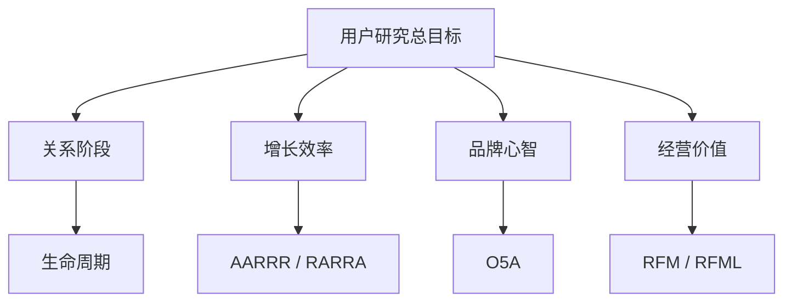

---
title: "用户研究方法：生命周期、AARRR、O5A 与 RFM 的组合框架"
categories:
  - 07_用户运营
tags: [用户运营, 用户研究, 用户生命周期, AARRR, O5A, RFM]
layout: post
mermaid: true
---

用户研究的难点，不在于模型太少，而在于容易把不同模型混为一谈。

在实际业务中，团队通常会同时面对四类问题：

1. 用户当前处于什么关系阶段。
2. 增长链路的瓶颈出现在什么环节。
3. 用户与品牌的心智关系推进到了哪一层。
4. 用户的经营价值是否值得重点投入。

本文围绕用户生命周期、AARRR / RARRA、O5A、RFM / RFML 四类框架，说明它们各自回答什么问题、适用于什么场景，以及如何组合使用。

---

## 1. 问题与边界

### 1.1 问题分类

| 研究问题 | 典型模型 | 适用重点 |
| --- | --- | --- |
| 阶段问题：用户现在处在哪个关系阶段 | 生命周期 | 运营策略、召回、促活 |
| 转化问题：用户在哪一环流失或卡住 | AARRR / RARRA | 增长诊断、漏斗优化 |
| 心智问题：用户与品牌关系走到了哪一层 | O5A | 品牌经营、内容投放 |
| 价值问题：用户是否值得重点经营 | RFM / RFML | 分层运营、资源分配 |

### 1.2 模型分工

四类模型看起来都在“分用户”，但分的是不同维度。模型选型时，建议先明确业务问题，再决定分析框架，而不是先背框架，再倒推场景。

---

## 2. 生命周期

### 2.1 阶段划分

生命周期模型强调的是用户与平台关系的变化过程，常见划分方式包括：

- 潜在用户
- 新用户
- 活跃用户
- 沉睡用户
- 流失用户
- 回流用户

在实际业务中，也可以按产品特征定义核心行为：

- 内容产品：登录、访问、阅读、互动
- 电商产品：下单、支付、复购
- SaaS 产品：开通、使用、付费、续费

### 2.2 适用边界

生命周期模型适合处理以下运营问题：

- 是否需要为新用户设计引导流程
- 活跃用户如何促频促活
- 沉睡用户是否值得召回
- 流失用户的界定标准是什么
- 回流用户是否需要二次激活

它的优势在于便于做关系管理和策略分发，但也有明显边界：

- 它能说明用户关系走到了哪一步。
- 它不能直接判断用户是否高价值。
- 它不能准确定位增长链路的卡点。
- 它也不能替代品牌心智分析。

---

## 3. AARRR / RARRA

### 3.1 AARRR

AARRR 通常包括以下五个环节：

- Acquisition：获客
- Activation：激活
- Retention：留存
- Referral：传播
- Revenue：变现

它适合回答的问题包括：

- 流量主要来自哪里
- 用户是否完成首次关键动作
- 用户是否持续回访
- 用户是否愿意传播
- 产品是否形成收入闭环

AARRR 的核心价值，在于把增长问题拆解为可观测、可度量、可优化的环节。

### 3.2 RARRA

RARRA 的顺序通常写作：

- Retention
- Activation
- Referral
- Revenue
- Acquisition

这一框架强调“先留住，再放大”。当产品留存能力尚未稳定时，盲目扩大获客只会放大漏损；当产品已经建立基本价值闭环后，再做拉新会更健康。

因此，可以简单理解为：

- AARRR 更适合冷启动、流量验证和快速扩张。
- RARRA 更适合价值已被验证、但需要提升增长质量的阶段。

---

## 4. O5A

### 4.1 分层结构

O5A 更偏品牌经营和人群资产沉淀，通常包括：

- Opportunity：机会人群
- Aware：认知人群
- Appeal：兴趣人群
- Ask：搜索与比较人群
- Act：行动或购买人群
- Advocate：复购与推荐人群

与传统“曝光 - 点击 - 下单”的转化漏斗相比，O5A 更关注的是用户与品牌关系的层层沉淀。

### 4.2 与生命周期的区别

O5A 和生命周期都在描述“用户会逐步向前推进”，但二者观察的对象不同：

- 生命周期关注用户与平台之间的关系状态。
- O5A 关注用户与品牌之间的心智关系。

例如，同样是一个已经购买的用户：

- 在生命周期里，他可能是活跃用户或忠诚用户。
- 在 O5A 里，他可能处于 Act 或 Advocate 阶段。

因此，O5A 更适合回答品牌经营中的问题：

- 品牌沉淀了多少认知人群
- 哪一层兴趣人群最关键
- 从种草到行动的链路是否顺畅
- 品牌资产是在积累，还是只做短期转化

---

## 5. RFM / RFML

### 5.1 RFM

RFM 是最常见的客户价值分层模型：

- Recency：最近一次消费距今多久
- Frequency：消费频次
- Monetary：消费金额

它主要用于识别以下人群：

- 高价值用户
- 高频低额用户
- 近期沉默用户
- 值得优先投入资源的用户

### 5.2 RFML

RFML 在 RFM 基础上增加了一个 L 维度，但 L 并非固定含义，常见有两种解释：

- Loyalty：忠诚度
- Length / Lifetime：关系持续时长

因此，可以把两者区分为：

- RFM：更适合判断当前交易价值。
- RFML：更适合把长期关系也纳入经营判断。

需要注意的是，RFM / RFML 与生命周期并不冲突：

- 生命周期回答“用户处于什么阶段”。
- RFM / RFML 回答“这个用户值不值得重点经营”。

---

## 总结

在实际业务中，四类模型更适合组合使用，而不是彼此替代。一个较稳妥的使用顺序如下：

1. 先用生命周期识别用户关系阶段，明确运营动作的基本方向。
2. 再用 AARRR 或 RARRA 定位增长链路中的关键瓶颈。
3. 如果业务涉及品牌经营，再用 O5A 识别人群心智层级。
4. 最后用 RFM 或 RFML 排定资源投入优先级。

可以把这套思路浓缩为四句话：

- **生命周期**看关系阶段。
- **AARRR / RARRA**看增长链路。
- **O5A**看品牌心智。
- **RFM / RFML**看经营价值。
